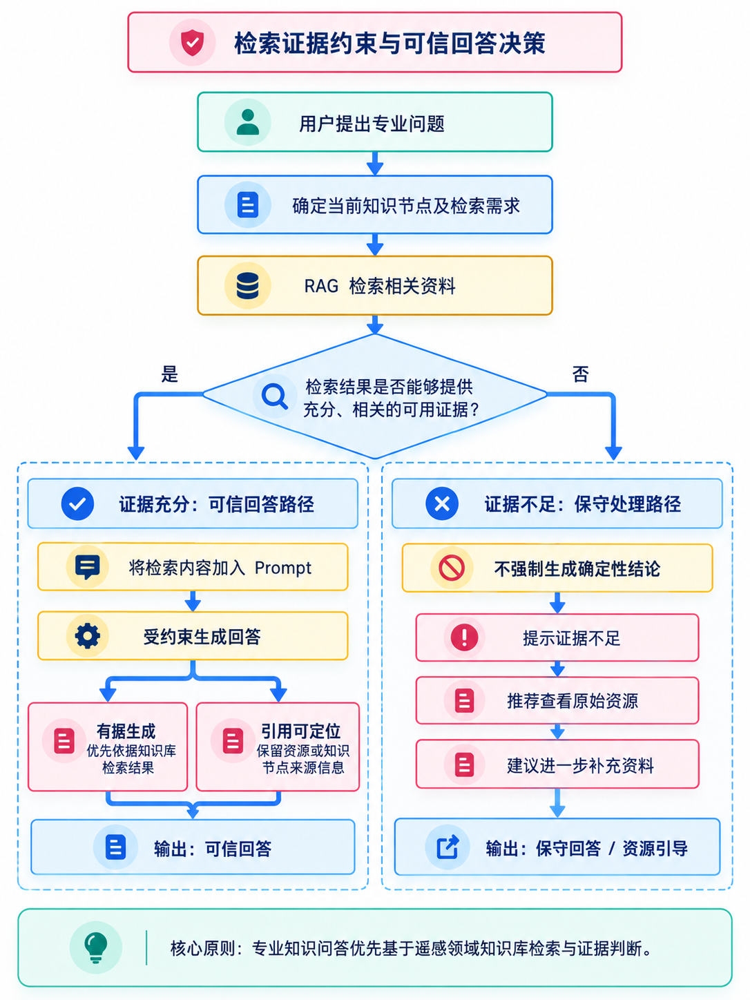
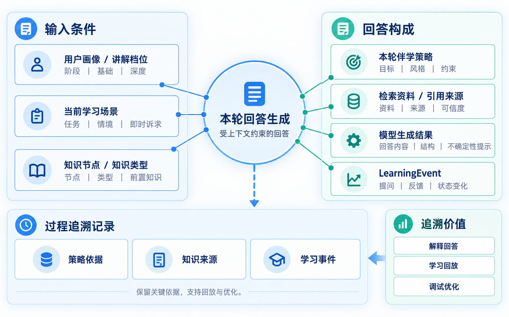
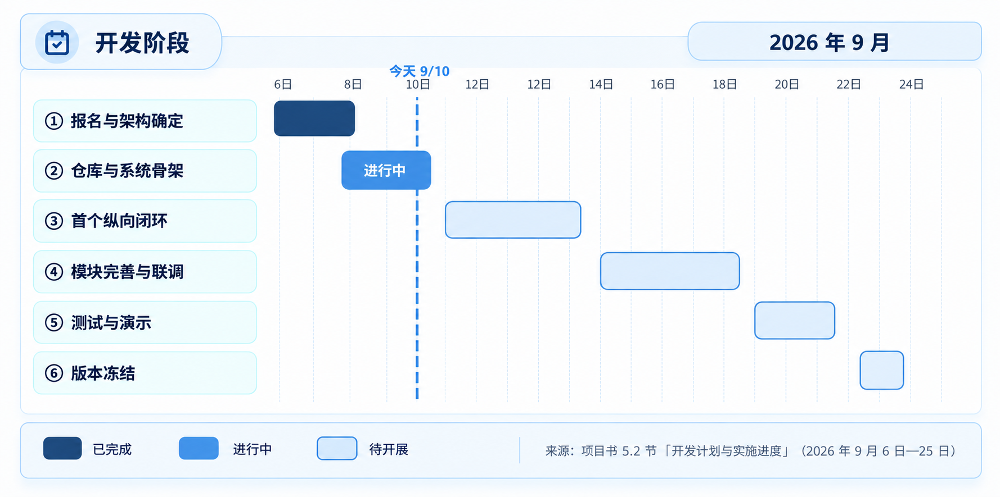

**目 录**

[摘 要](#摘-要)

[第一章 项目背景与问题界定](#第一章-项目背景与问题界定)

> [1.1 项目背景与实践基础](#项目背景与实践基础)
>
> [1.2 企业命题理解](#企业命题理解)
>
> [1.3 遥感专业学习与实训痛点](#遥感专业学习与实训痛点)
>
> [1.4 现有方案及其不足](#现有方案及其不足)
>
> [1.5 项目目标与边界](#项目目标与边界)

[第二章 用户需求与方案目标](#第二章-用户需求与方案目标)

> [2.1 目标用户与典型场景](#目标用户与典型场景)
>
> [2.2 学习者核心需求](#学习者核心需求)
>
> [2.3 项目需求分析](#项目需求分析)
>
> [2.4 需求优先级与命题响应](#需求优先级与命题响应)
>
> [2.5 预期解决效果](#预期解决效果)

[第三章 产品方案与核心设计](#第三章-产品方案与核心设计)

> [3.1 产品定位与核心价值](#产品定位与核心价值)
>
> [3.2 总体解决方案](#总体解决方案)
>
> [3.3 学习与实训闭环](#学习与实训闭环)
>
> [3.4 核心能力体系](#核心能力体系)
>
> [3.5 典型场景与拓展方向](#典型场景与拓展方向)

[第四章 技术实现与应用验证](#第四章-技术实现与应用验证)

> [4.1 系统总体架构](#系统总体架构)
>
> [4.2 专业内容与任务组织](#专业内容与任务组织)
>
> [4.3 学习行为与操作证据](#学习行为与操作证据)
>
> [4.4 学情诊断与动态学习路径优化](#学情诊断与动态学习路径优化)
>
> [4.5 伴学智能体与知识检索](#伴学智能体与知识检索)
>
> [4.6 原型实现与核心场景验证](#原型实现与核心场景验证)
>
> [4.7 安全可信、资料使用与降级方案](#安全可信资料使用与降级方案)

[第五章 项目价值与发展规划](#第五章-项目价值与发展规划)

> [5.1 项目创新与差异化优势](#项目创新与差异化优势)
>
> [5.2 当前成果与实施进度](#当前成果与实施进度)
>
> [5.3 团队协作与成员贡献](#团队协作与成员贡献)
>
> [5.4 企业合作与教育应用价值](#企业合作与教育应用价值)
>
> [5.5 推广模式与发展规划](#推广模式与发展规划)
>
> [5.6 项目风险及应对措施](#项目风险及应对措施)

[结 语](#结-语)

[参考文献](#参考文献)

[附 录](#附-录)

> [附录A 命题响应表](#附录a-命题响应表)
>
> [附录B 原型页面与开发状态](#附录b-原型页面与开发状态)
>
> [附录C 学习事件、诊断规则与错误样例](#附录c-学习事件诊断规则与错误样例)
>
> [附录D 资料来源与使用信息表](#附录d-资料来源与使用信息表)

# 摘 要

《遥感通》是由学生团队开发、面向任何有学习需求的人的大模型驱动自适应学习路径决策与伴学系统，响应中国国际大学生创新大赛科大讯飞企业命题《大模型驱动的自适应学习路径决策与伴学智能体开发》。项目围绕学情诊断、路径规划、实时干预、记忆与反思四项能力，以遥感学习为首个验证场景，帮助学习者识别知识缺口、选择学习内容，并在持续学习中调整顺序、难度与节奏。

系统以遥感知识图谱组织课程节点与先修关系，通过检索增强生成（RAG）提供专业依据。大模型通过诊断对话、主观作答和实训说明的量规评分参与学情分析，其评价结果经记录和校验后，与客观测试及任务验收共同进入规则服务，更新学习状态并生成后续路径。伴学智能体围绕当前路径主动提供分层提示、资料引导与复盘，学习者的新作答和任务结果再用于下一轮路径调整。

遥感特色体现在知识关系、影像案例、专业质量指标和软件学习资源的结合。ENVI、SNAP学习节点提供对应教学视频的流媒体链接，学习者在站内练习或提交外部实训结果后获得针对性反馈。伴学按个人画像、学习场景和知识类型调整讲解与资源形式，跨会话记忆支持学习接续；用户可编辑基础自述与偏好，实际学习记录独立保存。

项目以“多时相遥感影像配准质量诊断与改进”为首个验证场景，检验大模型评价、学习状态、路径变化和伴学干预之间的关联。目前已完成方案设计，原型正在开发，后续将通过功能测试、路径对照与学习者试用验证系统的可用性及学习支持效果。

# 第一章 项目背景与问题界定

## 1.1 项目背景与实践基础

《教育强国建设规划纲要（2024—2035年）》提出“促进人工智能助力教育变革”\[1\]，为探索个性化学习支持提供了政策背景。中国国际大学生创新大赛（2026）以“我敢闯，我会创”为主题，于2026年7月至11月举办；产业赛道围绕企业真实创新需求征集命题，鼓励参赛团队开展技术与产品研发\[2\]\[3\]。本项目结合企业命题，以遥感自主学习与实训需求为切入点，探索人工智能在自主学习中的应用。

生成式AI在教育领域的应用持续受到关注。Mordor Intelligence报告预计，生成式AI在课程设计与自适应学习系统领域的市场规模将从2026年的64.8亿美元增长至2031年的226.3亿美元，复合年增长率为28.42%\[4\]。OECD《数字教育展望2026》指出，具有明确教学目的、遵循清晰教学原则的生成式AI应用更可能带来持续的学习改善；任务表现提升并不必然意味着学习增益\[5\]。因此，本项目在引入模型能力的同时，重视专业内容组织、学习引导与结果验证。

遥感科学与技术融合地理学、测绘科学与计算机图像处理等领域，学习过程涉及理论理解、影像判读和软件操作。已有遥感课程群建设材料关注基础课、核心课与拓展课之间的能力衔接\[6\]，无人机数字测图研究也探索了虚拟仿真在遥感实践学习中的应用\[7\]。这些探索为课程与实训资源的组织提供了参考。对自主学习的学习者而言，还需要把分散资源与自身进度联系起来，明确当前知识缺口、下一步学习内容和任务完成标准。

遥感专业伴学既需要准确解释专业知识，也需要结合学习者的学习记录和课程先修关系提供持续支持。单次大模型问答难以承担上述完整流程，因此，本项目将专业资料、学习状态与路径规则纳入统一设计：利用知识图谱组织课程节点及其依赖关系，通过RAG为专业回答提供可引用的资料依据，结合学习记录、AI评分与客观验收结果，由规则模块更新节点状态并安排后续学习路径。该方案拟支持学习者从理解知识、完成实训到获得反馈和继续学习的连续过程，其实际效果将通过原型测试与学习者试用验证。

开发团队由遥感、计算机、人工智能和信息管理等专业学生组成，前期已开展课程学习场景调研与用户访谈，并参考现有智能教育产品的功能设计，推进遥感伴学系统的方案设计与原型开发。

<table>
<caption>
图1-1 专业内容、学习决策与学习者体验的衔接
</caption>
<colgroup>
<col style="width: 33%" />
<col style="width: 33%" />
<col style="width: 33%" />
</colgroup>
<thead>
<tr>
<th style="text-align: center;"><strong>专业内容与任务</strong></th>
<th style="text-align: center;"><strong>证据与规则</strong></th>
<th style="text-align: center;"><strong>学习者学习体验</strong></th>
</tr>
</thead>
<tbody>
<tr>
<td style="text-align: center;">
课程图谱与先修关系

权威教材与任务数据

软件教学视频流媒体链接
</td>
<td style="text-align: center;">
站内事件与提交结果

AI评分＋客观质量验收

规则更新状态与路径
</td>
<td style="text-align: center;">
视频跟做、练习与实训

分层提示与结果反馈

个人成长档案
</td>
</tr>
<tr>
<td style="text-align: center;">资料按节点关联</td>
<td style="text-align: center;">用户画像与学习记录分开</td>
<td style="text-align: center;">学习者自主选择目标与表达偏好</td>
</tr>
</tbody>
</table>

## 1.2 企业命题理解

命题《大模型驱动的自适应学习路径决策与伴学智能体开发》要求面向特定学科专业，设计并实现具备感知、规划和行动能力的自适应学习伴学智能体，并详细说明如何利用大模型实现动态路径优化\[12\]。本项目面向任何有学习需求的人，以遥感作为首个验证学科，通过学习路径决策和伴学过程的持续联动回应命题。

命题原稿列出四项核心能力，本项目分别落实为：

> （1）学情诊断：通过自然语言对话或测试分析知识掌握情况。系统以诊断问答、测验和实训结果提供证据，区分用户自述画像、实际学习记录与状态估计。
>
> （2）路径规划：基于画像与知识图谱动态生成学习路径，适配学习顺序、内容难度和学习节奏。大模型评分参与形成状态输入，规则服务依据该状态及课程约束生成可执行路径。
>
> （3）实时干预：在学习者遇到困难时提供脚手架式辅导。系统根据站内作答、提示请求和提交结果识别干预时机，由智能体逐步追问、定位资料并给出针对性提示，支持学习者独立解决问题。
>
> （4）记忆与反思：跨会话保存学习进展，依据历史数据复盘并调整后续计划。系统关联画像、节点摘要、学习证据与路径版本，结合大模型复盘和规则重算支持学习接续。

本项目采用“大模型参与学情评价与伴学、知识图谱提供课程约束、规则服务执行路径决策”的实现方式。遥感实训提供可观察、可验证的专业学习证据，支撑四项能力在同一场景中运行。三维伴学、视频资源和学科星图分别承担个性化表达、学习材料与内容导航功能，共同服务动态路径优化。

答题材料应包括商业计划书、源代码或可运行演示Demo，以及3—5分钟展示智能体与用户交互过程的演示视频；技术说明需覆盖智能体架构、知识库构建方式和大模型参与动态路径优化的机制。项目还需从命题企业角度说明需求与合作方式，准备网评和路演材料\[12\]。本项目的能力响应与交付要求分别见附录A的表A-1、表A-2。

| **层次** | **主要组件与职责** |
|:--:|:--:|
| 学习体验 | 学习驾驶舱、学科星图、节点学习、成长档案与设置 |
| AI支持 | 诊断问答与量规评分形成评价证据；小遇提供主动提示、路径解释与跨会话复盘 |
| 规则与记录 | 规则服务更新LearnerState与PathDecision；LearningEvent保存学习证据；UserProfile保存用户自述 |
| 内容资源 | 公共权威资料、用户课本、个人笔记分开；软件节点绑定视频流媒体链接 |
| 技术支撑 | Vue／FastAPI；MySQL、Qdrant与文件存储；模型API与版本化记录 |

图1-2 系统总体架构与数据流转

## 1.3 遥感专业学习与实训痛点

结合相关研究与学习者访谈，项目重点关注以下四类学习困难：

（1）知识体系复杂，学习者缺少学科全局视角，知识缺口难以定位。

遥感知识的先修关系随任务目标而变化。例如，基于表面反射率开展定量反演或跨时相比较时，需要理解辐射定标与大气校正；使用已有表面反射率产品时，则无需重复进行大气校正\[17\]。一般目视解译和部分定性分析的前置要求有所不同。分散教材和操作教程往往难以清楚呈现这些关系，学习者即使能够复现操作，也可能不清楚参数依据及所需的前置知识。

（2）学习安排难以适应不同基础与目标。

学习者在不同阶段对同一知识点的需求并不相同：初学时需要理解概念与知识联系，系统进阶时需要掌握公式和算法，解决实际问题时更关注方法选择与结果验证。相同学历或职业背景也不意味着掌握程度相同，系统应结合用户自述与实际学习证据调整讲解深度、资源类型和后续安排。画像用于表达学习者的基础、目标与偏好，节点掌握状态则由独立记录的作答和任务结果估计。

（3）实训环节问题多，过程缺少诊断与脚手架式提示。

ENVI、SNAP等专业软件的学习要求学习者同时理解操作步骤、参数含义和结果变化。软件版本差异与报错信息又会增加跟做难度。学习者需要按任务组织的视频演示、分步清单和即时答疑，并在提交实训结果后获得针对性的评价与改进建议。

（4）专业伴学需要持续的资料、状态与课程支持。

专业伴学需要同时回答“依据什么资料”“学习者学到哪里”和“下一步如何安排”。资料检索用于支持专业解释，学习记录用于估计节点状态，课程先修关系用于约束学习顺序。这些信息需要在连续学习中共同发挥作用，才能为遥感任务提供有依据的引导。

| **类别** | **具体痛点表现** |
|:--:|----|
| **知识认知层面** | 知识点依赖关系不清晰，学习者看不清学科全貌，难以定位自身知识缺口 |
| **教学路径层面** | 不同基础与目标的学习者需要不同的讲解深度、学习节奏与训练安排 |
| **实训实践层面** | 软件步骤与原理难以对应；视频、分步提示及实训结果反馈需要按任务组织 |
| **现有工具层面** | 通用工具应用于遥感课程时，需要关联资料来源、节点状态与课程先修约束 |

表1-1 遥感专业学习痛点汇总表

## 1.4 现有方案及其不足

现有工具主要包括课程平台、资料型AI学习工具，以及自适应学习和虚拟实验产品。以下依据公开功能与应用案例，比较其对课程组织、学习支持和实训评价的启示。

1.  课程教学平台（超星、雨课堂等）

超星平台的知识图谱教程展示了知识点与视频、文档、考核资源的关联，以及完成与掌握情况统计\[13\]。安徽工程大学的雨课堂应用采用模型层、引擎层和应用层三层架构，提供课程图谱、个性化资源推荐与持续伴学\[14\]。这些能力为课程组织与学习反馈提供了基础，遥感场景还需配置适用的软件视频、专业任务和评价标准。

2.  资料型 AI 研究与学习工具（Gemini Notebook，原 NotebookLM）

Gemini Notebook（原NotebookLM）提供资料管理、基于来源的问答、笔记同步和代码与数据分析能力\[11\]，适合围绕学习资料开展整理与讨论。本项目在资料支持之外，重点设计遥感课程节点、软件学习、实训结果评价与规则路径之间的衔接。

3.  现有自适应学习与智能伴学系统（Khanmigo、Labster、松鼠 AI 等）

这类产品从学习引导、过程评价和自适应推荐等角度提供了参考：

Khanmigo通过追问与提示帮助学生完成推理\[8\]。本项目借鉴这种分层引导方式，将其结合到遥感资料学习、软件跟做和实训结果反馈中。

Labster提供仿真内测验计分、重复尝试处理，以及完成进度、分数和尝试记录查询\[9\]，展示了虚拟实验与过程评价结合的方式。本项目重点面向遥感任务，结合软件教学视频与学习者提交的成果开展评价。

松鼠AI以自适应学习为主要定位\[10\]。其学习支持方式可作为参考；面向高校遥感任务的适配情况，仍需结合具体产品版本与课程配置比较。

| **比较项** | **课程平台（超星、雨课堂）** | **Gemini Notebook** | **自适应／虚拟实验产品** |
|----|----|----|----|
| 已公开的相关能力 | 知识图谱、资源关联、学习统计与个性化支持；依平台配置\[13\]\[14\] | 资料持久保存、来源引用、笔记同步与代码分析\[11\] | 引导式伴学、仿真测验、尝试记录或自适应学习；依产品定位\[8\]—\[10\] |
| 遥感任务适配需求 | 配置对应软件版本的视频、专业任务与评价标准 | 衔接课程节点状态、实训评价与学习路径 | 匹配遥感专业内容、任务形态与结果评价 |
| 本项目的设计重点 | 关联软件教学视频、站内学习事件和学习者提交结果 | 结合可编辑画像、学习记录和规则路径支持自主学习 | AI参与评分，客观验收与规则决定状态及路径 |

表1-2 现有工具的相关能力与遥感任务适配需求

注：比较依据所列公开资料与应用案例，功能随版本和配置而异；本项目栏为拟建设内容，效果将在任务测试与学习者试用中验证。

现有产品为知识组织、伴学和过程评价提供了可借鉴的做法。遥感通将这些能力结合到学习者自主完成专业任务的过程中，重点解决软件视频与知识节点如何对应、实训结果如何转化为反馈、后续学习如何依据证据调整等问题。后续将围绕相同任务目标比较资料可用性、引导方式、评价依据和路径变化。

## 1.5 项目目标与边界

### 1.5.1 总体目标

项目目标是建立面向任何有学习需求的人的大模型驱动自适应学习路径决策与伴学系统，使学习者能够在持续交互中获得有依据的诊断、动态学习安排和针对性辅导。系统围绕学情诊断、路径规划、实时干预、记忆与反思组织功能，首版以遥感影像配准实训验证从诊断到路径调整、再到伴学与复盘的完整过程。

### 1.5.2 具体目标

内容层面：建设遥感学科总图和一门核心课程样板，课程及节点数量待定；定义知识节点的前置、后置依赖关系，关联教材、课件等学习资料，构建遥感领域知识图谱与 RAG 知识库。

技术层面：利用大模型对诊断问答、主观作答和实训说明进行量规评价，将记录后的评分与客观证据交由规则服务更新状态，按知识图谱约束优化学习顺序、难度和节奏；以RAG支持专业问答与分层干预，以跨会话记忆支持复盘及后续计划调整。总体架构、路径机制和智能体架构分别见4.1、4.4和4.5。

产品与原型层面：形成学习驾驶舱、学科星图、学习路径、节点学习与实训、成长档案、设置与安全控制等完整产品设计；比赛版本优先完成影像配准实训完整学习流程，并逐步将其他页面接入统一事件、状态与路径服务。

成果层面：按命题组织商业计划书、源代码或可运行演示Demo、3—5分钟演示视频，并配套命题响应表、系统架构、知识库构建说明和动态路径优化验证记录。各交付物的准备与核验方式见附录A，完成状态以实际文件和运行记录为准。

### 1.5.3 项目边界

1.  专业范围：围绕遥感学习与实训组织现有算法和工具，提供操作指导与结果评价；底层影像处理算法研发和生产级遥感业务软件开发不在本项目范围内；

2.  模型使用：通过DeepSeek API调用大模型，结合知识图谱、RAG和提示词实现伴学；模型适配层保留替换能力，暂不进行模型权重微调；

3.  服务对象与使用方式：产品面向任何有学习需求的人，按学习目标、已有基础和任务需要提供支持，覆盖知识入门、系统学习、技能提升、工作实践与兴趣探索等场景；学习者自主选择目标、完成任务并查看反馈；

4.  内容范围：原型阶段以遥感为首个验证学科，聚焦一门课程的细粒度图谱；服务对象不设学历或职业限制，实际可支持的学科与任务随资料、节点和评价规则建设逐步扩展，具体范围待定。

# 第二章 用户需求与方案目标

本章围绕学习者在课程入门、软件学习、实训和个人复盘中的需要，明确目标用户、核心需求与首版功能优先级。

## 2.1 目标用户与典型场景

系统面向任何有学习需求的人，包括在校学生、在职学习者、转专业或转岗学习者及兴趣自学者。功能按入门探索、系统进阶和任务实践三类需求组织：初学者需要选择起点并理解知识联系，进阶者需要巩固方法并安排学习顺序，实践者更关注技能应用与结果验证。学习支持结合已有基础、目标、可用时间和实际记录安排。学习者自行设定目标、完成任务并查看成长记录，学生开发团队负责内容整理、规则维护和软件测试。首版以遥感课程和实训检验上述机制。

| **用户** | **主要学习困难** | **对应支持方式** |
|:--:|----|----|
| **入门探索者** | 了解学科范围、选择起点并理解知识联系 | 通过知识图谱呈现课程结构，结合伴学引导与节点小测建立基础 |
| **系统进阶学习者** | 选择进阶内容与专业方向 | 结合兴趣、学习经历与掌握情况推荐后续课程和方向 |
| **技能提升与任务实践者** | 如何选择方法、完成软件操作并验证结果 | 学习资料、软件视频、结果诊断与个人复盘记录 |

表2-1 目标用户与典型场景

## 2.2 学习者核心需求

遥感、GIS与摄影测量学习中，学习者常遇到理论难以转化为实际操作、指导书与软件版本不匹配、报错信息缺少上下文等问题。系统据此提出自主学习的核心需求：理解知识、完成练习与实训、获得及时反馈、看见能力变化，并逐步明确适合自己的学习方向。

### 理论知识需要及时练习与巩固

理论学习与练习间隔较长时，学习者可能难以及时巩固概念和公式，也不易从综合题结果中定位具体知识缺口。系统应在节点学习后安排针对性练习，及时呈现作答结果与解析，使学习者能够完成学习、检验和修正。

### 专业软件学习需要适应软件版本变化

ENVI、SNAP及其他专业软件的界面与功能入口随版本变化。软件学习节点应提供对应教学视频的流媒体链接，标明软件名称、版本、任务、章节时间点和来源，配合分步清单帮助学习者跟做；未覆盖的版本差异由伴学明确提示并引导核对官方文档。

### 软件操作中的突发报错需要快速定位与解决

传统指导书主要描述标准流程，难以覆盖参数设置不当、结果异常和软件报错等非标准情况。学习者向通用大模型求助时，通常只能提供零散截图和不完整的操作描述，系统难以准确还原上下文。产品需要结合当前步骤、软件版本、报错原文和操作记录定位问题，并给出明确、可执行的修正建议。

### 软件指导需要从静态阅读转向交互式学习

仅由文字与截图组成的指导书容易使学习者在讲义与软件之间频繁切换，也难以理解每一步操作的目的和影响。系统应将原理说明、过程演示、交互练习与结果对比结合起来，使学习者在复现步骤的同时理解操作与结果之间的关系。

### 学习者需要获得连续、个性化的学习反馈

学习者需要同时了解学习进度与掌握情况。系统通过浏览、练习和实训记录呈现已完成内容、节点状态与近期错误，并结合用户自述目标和兴趣提出后续建议，帮助学习者持续回顾和调整学习安排。

### 学习者需要在学习过程中发现适合自己的专业方向

本项目拟按以下方向组织遥感学习内容：遥感信息、摄影测量、地理信息工程、遥感仪器、地理国情监测、空间信息与数字技术等方向。初学者难以仅凭专业介绍完成方向判断，系统应结合持续学习记录、任务表现与兴趣倾向，逐步提供可解释的方向参考。

| **理解与练习** | **软件学习** | **问题分析** |
|----|----|----|
| 知识讲解→针对性练习→及时反馈 | 对应版本的视频与步骤→跟做实践 | 结合任务、参数与报错信息→定位可能原因 |
| 交互实践 | 持续反馈 | 学习方向 |
| 阅读、演示与站内练习相结合 | 学习记录→节点状态→后续安排 | 结合目标、兴趣与表现→探索课程及技能方向 |

图2-1 学习者核心需求

## 2.3 项目需求分析

遥感通围绕专业任务组织知识学习、实训评价与路径规划。系统需要帮助学习者理解任务要求，判断当前知识能否支持操作，并在受阻时提供有依据的问题分析与改进建议。

为此，产品需要同时建立四类基础：可计算的专业内容结构、能够执行和评价的遥感实训任务、可追溯的学习与操作证据、受规则约束的智能反馈与路径决策。学科星图用于呈现方向、课程、任务与知识节点的关系；智能体参与评分、解释和引导；规则模块依据操作证据判断错误与能力变化；路径模块根据新的状态安排后续学习与训练。

用户上传资料分为课本和个人笔记。文件上传后由系统自动解析并建立检索索引，解析完成后可用于本人的学习问答。课本按权威资料使用，保留可识别的书名、作者、版本和页码等来源信息，回答使用时必须引用；个人笔记用于理解学习者思路、提出学习建议和提示可能错误，不直接作为专业结论的权威依据。上传资料默认仅本人可用，不会自动共享给其他用户。

| **需求** | **对应设计** | **学习者获得** |
|----|----|----|
| 课程与专业方向 | 图谱、任务及先修关系 | 理解学习范围和下一步 |
| 软件学习 | 按版本提供视频流媒体链接与跟做清单 | 观看、提问、练习与提交结果 |
| 评价与路径 | AI参与评分，规则执行状态与路径决策 | 查看评分依据和后续安排 |
| 个人空间 | 可编辑画像；学习记录独立保留；课本与笔记分类 | 控制自述与偏好，回顾真实学习过程 |

图2-2 项目需求分析

## 2.4 需求优先级与命题响应

首版围绕命题四项核心能力安排同一优先级的开发：学情诊断、路径规划、实时干预、记忆与反思需在一条学习流程中衔接。影像配准作为首个验证任务，资料、视频和必要课程节点为该流程提供支撑；学科星图展示与完整课程体系扩展在核心流程之上逐步完善。

| **优先级** | **建设内容** | **对应功能** |
|:--:|----|----|
| **P1** | 学情诊断 | 诊断对话与测试、实训说明的AI量规评分、客观结果验收共同提供状态估计依据 |
| **P1** | 路径规划 | 基于画像、学习状态和知识图谱，用版本化规则调整学习顺序、任务难度与节奏，并保存变更理由 |
| **P1** | 实时干预 | 依据作答困难、提示请求或提交结果触发追问、分层提示和资料定位，帮助学习者自主修正 |
| **P1** | 记忆与反思 | 跨会话保留必要学习背景，结合历史作答、提示与路径版本复盘，并按新证据更新后续计划 |
| **P2** | 导航与内容扩展 | 在一门课程样板的基础上完善学科星图、课程与任务资源；样板课程及节点数量待定 |

表2-2 学习者需求优先级

首版以影像配准实训承载四项核心能力，同时准备必要的课程关系、资料和软件视频。完整课程体系拟按六个方向组织，候选课程清单约60门，统计见4.2.5；实际建设范围待定，扩展计划见5.5.2。

四项能力共同构成连续学习过程：大模型评价参与诊断，状态与图谱约束支撑路径规划，智能体按困难提供实时干预，学习记录与长期记忆支持复盘。复盘后的新作答、任务结果或用户确认的目标变化进入下一轮规则计算，使路径随有效证据持续调整。

## 2.5 预期解决效果

项目预期帮助学习者明确任务所需知识、定位操作问题、理解验收结果，并据此选择后续学习内容。

学习者可以先通过课程图谱和视频理解任务，再通过练习与成果提交获得评价，在分层提示下完成修正。系统保留学习证据、状态变化与推荐理由，便于学习者回顾错误、比较改进过程并复用相关材料。

| **学习需要** | **系统支持** | **预期结果** |
|:--:|----|----|
| 不知道从何起步 | 课程图谱＋目标与先修约束 | 学习范围清楚 |
| 软件步骤难以理解 | 视频章节＋跟做清单＋分层提示 | 能跟做并提出具体问题 |
| 结果缺少反馈 | AI量规评分＋客观验收 | 理解结果与改进方向 |
| 下一步安排不清晰 | 依据学习记录执行路径规则 | 推荐有据、变化可查 |
| 画像判断不符合自述 | 用户修改画像，历史记录独立保留 | 个性化可控，学习过程可回顾 |

图2-3 预期解决效果

# 第三章 产品方案与核心设计

## 3.1 产品定位与核心价值

1.  产品定位

《遥感通》由学生团队开发，面向任何有学习需求的人提供自适应学习路径与持续伴学。系统围绕“当前掌握怎样、下一步学什么、遇到困难如何继续、下次学习如何接续”组织诊断、规划、干预和记忆；遥感课程与实训作为首个验证场景，提供具体的知识内容、学习证据和任务标准。

2.  核心价值

<!-- -->

1)  对学习者：明确学习目标与下一步安排，查看评价和推荐依据，并通过可导出的成长记录开展复盘；

2)  对企业：提供面向不同学习背景的自主学习场景及可适配不同模型和学科内容的系统设计，以遥感课程作为首个验证案例。

<!-- -->

3.  学习问题与产品回应

表3-1列出专业学习中的主要问题及对应设计。

| **学习问题** | **产品回应** |
|:--:|----|
| **专业学习不仅要知道，更要会做** | 以真实遥感任务连接知识、操作、诊断和评价，让学习者能够完成并解释专业工作 |
| **学习路径不是固定目录** | 路径由目标、前置知识、掌握证据和学习节奏共同决定 |
| **节点掌握情况需要结合多种学习证据判断** | 知识测验、提示使用、专业操作、修正结果等证据分别进入状态模型 |
| **伴学智能体不应直接替学习者完成任务** | 通过追问和分层提示，帮助学习者理解知识并自主完成任务 |
| **专业内容必须有边界和来源** | 使用学习者选定的学习资料进行检索增强，并保留节点与资料的对应关系 |

表3-1 学习问题与产品回应

## 3.2 总体解决方案

产品由“专业内容与任务—证据与决策引擎—学习与实训体验”三部分组成。知识图谱和资料为学习提供专业约束；大模型通过问答与评分参与诊断，规则依据评价证据生成动态路径；网页与伴学智能体组织学习行动、困难干预和复盘。新的作答与任务结果写入LearningEvent，供下一轮状态更新和路径重算使用。

### 3.2.1 专业内容与任务：节点、资料与评价依据

1.  两层图谱结构：学科总图（课程、方向）与课程详情图（概念、方法、工具）统一表达，节点之间建立“前置依赖、包含、应用、相关”四类关系；

2.  依赖可解释：每条依赖关系都携带“为什么先学 A 再学 B”的原因说明，用于路径阻塞解析与推荐理由生成；

3.  资料与节点关联：上传资料经系统解析后建立检索索引，记录来源类型、名称、定位信息及所属账户，供学习者在个人学习中选用；回答使用专业资料时附带可定位引用。

### 3.2.2 自适应引擎：大模型评价与规则路径决策

1.  候选生成：只有前置条件已经满足、且尚未充分掌握的节点进入候选集合，保证推荐始终是“现在学得动”的节点；

2.  路径排序：综合目标相关性、知识缺口、难度适配、学习连续性和近期重复情况对候选节点排序，输出有序路径与每条推荐的理由；

3.  学习状态更新：大模型依据量规评价诊断对话中的实质性作答、开放题与实训说明，记录分项评分及依据；规则服务结合这些评分、客观测试与任务验收估计节点状态。用户自述、阅读和观看记录仍按各自类型管理。

4.  路径重算与版本化：有效学习证据、目标或时间安排发生变化后，按规则重新检查候选与任务配置，保存顺序、难度、节奏及其调整原因；未产生实质变化时沿用原版本。

5.  大模型参与动态路径优化的过程是“语义评价形成评分证据—规则更新学习状态—图谱约束下重算路径—智能体解释并引导执行”。最终候选、排序和解锁由规则服务决定，AI评分不得绕过校验直接写入路径；回放复用已记录的评分与版本。规则的确定性保证同一输入可复算，评分质量则通过独立样例核验。

### 3.2.3 学习与实训体验：把诊断和决策转化为行动

学习者通过以下五类入口查看任务、开展学习和使用反馈。各入口承载的能力可按首版范围及后续计划逐步完善：

1.  学习驾驶舱：呈现当前目标、学习位置、推荐节点与最近变化，是学习者每天进入系统的第一站；

2.  学科星图：浏览学科与课程全貌、查看节点依赖关系，从“地图”直接进入学习；

3.  学习路径：查看当前路线、任务前置要求、被阻塞节点与替代路线，理解决策依据并主动调整；

4.  节点学习与实训：围绕一个知识或技能节点完成“理解目标—学习资料—专业操作—诊断反馈—修正验证”的完整任务；

5.  成长档案：回顾掌握变化、学习证据、错误标签与历史路径，形成个人知识资产。

## 3.3 学习与实训闭环

学习者先说明学习目标并完成诊断问答或测试，系统结合大模型评价与已有证据形成起点状态，按知识图谱和规则生成初始路径。学习过程中，智能体在发现困难时提供分层干预；学习者继续作答或提交实训结果后，规则更新状态、调整路径。阶段复盘与跨会话记忆将本轮进展连接到下一次学习。

1.  闭环主链路

确认学习目标 → 对话或测试诊断 → 大模型评价与规则状态估计 → 图谱约束下生成路径 → 知识学习与专业实训 → 困难触发分层干预 → 提交结果并再次评价 → 规则更新路径 → 复盘与跨会话接续

闭环各环节的系统机制与学习者可感知的结果见表 3-2。

| **环节** | **系统机制** | **学习者可感知的结果** |
|:--:|----|----|
| **① 目标确认与起点诊断** | 通过目标、诊断问答、测验和已有记录形成起点状态 | 知道要完成什么、评价标准是什么 |
| **② 必要知识与路径准备** | 结合大模型评价形成的状态输入，按图谱与规则安排学习顺序、难度和节奏 | 看到为什么先学、先练这些内容 |
| **③ 专业操作与证据采集** | 记录参数、控制点、误差、重试和操作结果 | 关键操作与提交结果有记录可查 |
| **④ 评价与状态诊断** | 大模型参与量规评分，规则结合客观验收估计状态并记录证据 | 知道错在哪里以及属于哪类问题 |
| **⑤ 智能反馈与修正** | 智能体结合诊断和关联学习资料追问、提示并解释 | 获得分层引导并自主完成修改 |
| **⑥ 再次评价与能力更新** | 记录修正后的作答、AI评分与质量指标，按规则更新知识与技能状态 | 查看拟合误差、独立检查点误差与能力状态估计变化 |
| **⑦ 路径调整与复盘** | 依据新状态重算路径，记录顺序、难度、节奏与版本差异，生成学习摘要 | 理解下一步安排和变更依据，下次学习可接续本轮进展 |

表3-2 学习与实训闭环的环节与机制

2.  闭环的三个设计约束

<!-- -->

1)  证据先行：诊断、评价和路径变化均关联学习事件或任务结果，便于检查结论来源；

2)  脚手架优先：任务受阻时先定位错误类型，再通过追问、规则提示和分层解释引导学习者修正，不直接代替学习者完成专业操作；

3)  可解释、可复现：操作证据、诊断规则、提示层级、评价结果、推荐理由和路径版本全部留痕，修正前后差异可以复查和重放。

<!-- -->

3.  从课程任务扩展到方向与项目

当前闭环以一门核心课程中的影像配准实训为验证场景。后续拟结合遥感分类、变化检测、定量反演等任务，补充相应的知识节点、学习资料和评价规则；具体扩展课程与任务范围待定。

## 3.4 核心能力体系

为实现命题规定的学情诊断、路径规划、实时干预、记忆与反思四项能力，产品配置专业内容、任务实训、过程诊断、智能伴学和学习评价五类支撑模块。内容与任务提供专业材料和学习证据，诊断与评价支撑状态更新，路径引擎据此安排后续学习，智能伴学负责交互、困难干预和复盘。

| **支撑模块** | **回应的问题** | **关键机制** | **学习者可感知** |
|:--:|----|----|----|
| **专业内容组织** | 任务需要哪些知识、材料和规则 | 两层图谱＋关联学习资料＋评价边界 | 看得见任务与知识、技能、材料的关系 |
| **任务实训** | 学习者是否能够把知识用于真实操作 | 真实数据＋专业步骤＋操作记录＋结果指标 | 完成一次可操作、可修正、可验证的专业任务 |
| **过程诊断** | 错误发生在哪里、为什么发生 | 诊断问答与任务证据＋AI量规评分＋规则状态估计 | 获得针对具体操作的诊断 |
| **智能伴学** | 卡住后如何自主改正 | 诊断上下文＋追问＋分层提示＋资料引用 | 获得有依据的引导而不是被代做 |
| **学习评价** | 修正是否有效、能力如何变化 | AI评价与客观验收＋状态更新＋证据回放＋成长档案 | 看见指标、能力和后续路径的变化 |

表3-3 四项命题能力的五类支撑模块

### 3.4.1 专业内容组织

目标：将专业知识及其关系组织为可检索、可计算的课程内容，支撑任务学习与路径决策。

1.  内容结构化：统一表示课程、方向、概念、方法与工具，并为节点间的依赖关系记录具体依据；

2.  资料可信化：资料与节点绑定，确保伴学回答与学习资料同源；

### 3.4.2 任务实训

目标：以输入数据、操作要求和完成标准组织专业任务，让学习者能够执行、检验并改进结果。

1.  任务载体：以知识节点或专业技能节点为最小单元，每个任务包含目标、前置要求、输入数据、操作步骤、关联资料、常见错误、评价规则和完成标准；

2.  任务执行：理解目标—阅读资料或观看软件教学视频—跟做或完成站内交互—提交结果—查看评分与诊断—请求提示—修正并再次验证。系统记录站内可观测行为与提交结果，并区分平台直接记录和学习者提交的信息来源。

3.  任务反馈：任务结果经评价规则转化为能力证据，更新 LearnerState，并可能触发后续训练任务与学习路径变化；

4.  任务体系延伸：完整产品支持节点任务、综合实训和项目任务三级组织，后续可从影像配准扩展到分类、变化检测、反演等遥感综合实践。

### 3.4.3 过程诊断

目标：在学习开始、任务执行和结果提交等阶段持续提供诊断支持。

1.  起点诊断：通过自然语言诊断问答、基础测验、学习目标与已有记录检查关键先修知识。AI对可评价的作答按量规评分，规则结合评分与客观结果估计起点状态，据此配置初始路径、任务难度和提示起点。

2.  过程诊断：把参数选择、控制点布设、误差检查、提示使用、重试和任务结果等持续转化为证据，识别学习者卡在概念、参数、步骤还是结果判断；

3.  错误标签：依据完成资料核对与样例测试的规则将问题归纳为概念认知误区、参数理解偏差、操作遗漏和结果判断错误等类型，可追溯到对应事件与任务步骤；

4.  状态管理：知识节点和技能节点分别维护“未开始、学习中、已掌握、需复习”等状态；知识理解与操作达标采用不同证据更新，避免把看过资料等同于会做任务。

### 3.4.4 智能伴学

目标：构建能感知学习上下文、参与诊断评价、协同规划服务并提供学习行动支持的伴学智能体，使学习者在需要时获得主动引导。

1.  分层引导：学习者请求提示、重复作答困难或提交结果未达标时，按配置条件触发干预。智能体先追问理解与操作依据，再逐层给出概念提示、资料定位和操作建议，鼓励学习者先尝试再获得更充分的解析；触发条件与提示层级分别记录。

2.  内容有边界：回答依据学习者选定的资料与当前节点关联资料并标注引用；证据不足时如实说明，引导学习者查看可定位来源、补充问题上下文或提交内容纠错反馈；

3.  跨会话记忆：会话形成摘要，下一次学习能接续此前的疑问与进度，避免“每次从零开始”；

4.  评分与路径分工：AI承担讲解、提示和量规评分；状态更新、节点解锁及路径排序由规则服务执行，模型评分与规则决策分别留痕。

5.  学习复盘：阶段结束时，智能体结合历史作答、提示使用、结果变化与路径版本总结尚未解决的问题。复盘用于安排针对性再测与后续学习建议，新测试结果或用户确认的目标变化再进入规则计算；模型总结不直接改写原始记录或掌握状态。

### 3.4.5 学习评价

目标：建立过程性、可追溯、面向成长的学习评价。

1.  掌握度模型：为每个“学习者—节点”维护掌握度与状态。诊断、小测、提示、重试、阅读和视频观看均纳入学习记录，按证据类型参与状态更新：阅读与观看记录接触情况，不单独视为学会；作答、经验证的修正和任务结果作为相应能力证据。权重与折扣的示意规则见附录C，具体数值待定。

2.  全过程留痕：每次变化都记录变化前后值与原因，形成可回溯的掌握曲线；

3.  多维评价：AI依据题目、参考资料与评价量规参与主观作答和实训报告评分，返回分项分数、依据与反馈；客观题及RMSE_check等质量指标按可计算规则验收。规则服务校验评分结构与证据关联后更新状态，再计算学习路径。AI评分属于评价结果，需保留模型、量规和输入版本；提示、重试与独立完成程度同时记录。

4.  成长档案：学习者可查看掌握变化、学习证据、错误标签与历史路径，并可导出个人成长报告；

上述模块共同支撑学情诊断、路径规划、实时干预、记忆与反思四项命题能力，其中学习评价为诊断与动态路径优化提供证据，具体响应关系见附录A。

## 3.5 典型场景与拓展方向

### 3.5.1 核心验证场景：影像配准质量诊断与改进

产品核心演示跟随一名学习者完成“多时相遥感影像配准质量诊断与改进”实训，完整覆盖任务、操作、诊断、干预、修正、评价与路径调整：

1.  学习者接收两期存在空间偏移的遥感影像，理解配准目标和误差评价标准；

2.  学习者选择和调整地面控制点，系统记录控制点位置、空间分布、单点残差与拟合误差 RMSE_fit，并保留不参与拟合和调参的独立检查点用于 RMSE_check 验收；

3.  当控制点集中在局部区域或个别控制点残差异常时，确定性规则定位问题，智能体依据关联学习资料提供分层提示；

4.  学习者核验异常点、调整布点或修正模型后，分别查看RMSE_fit与RMSE_check。验收以独立检查点误差为主，卷帘对比用于辅助观察；两类误差分别解释，保留拟合误差在有效修正后仍可能上升的情况。

5.  系统保存操作、提示、修正和结果证据，更新相关知识与技能状态，并生成下一步训练建议或路径变化。

### 3.5.2 差异化验证：不同基础学习者的干预与路径差异

差异化验证设置两组不同起点的测试案例，采用相同任务规则和接口。基础薄弱的案例重点观察前置补学、分步提示和基础训练；已有基础的案例重点观察局部问题诊断与进阶任务推荐。通过比较状态更新和路径版本，检查系统能否根据已有证据提供不同支持。

### 3.5.3 拓展方向

1.  学科拓展：后续拟结合学习者需求补充相关课程与学习资料，具体学科范围待定；

2.  目标拓展：目标类型覆盖“掌握课程、进入方向、完成项目”三类，闭环可从单课程学习延伸到方向规划与项目式学习；

3.  任务拓展：节点任务预留了与综合实践任务衔接的接口，后续可将遥感专业实践场景纳入任务体系；

4.  技术拓展：模型适配层为不同大模型API预留统一接入接口；多模态交互可围绕影像判读与对比任务逐步加入语音、手势和图像理解能力。

# 第四章 技术实现与应用验证

本章介绍系统架构、专业内容、学习证据、AI评分、规则决策与安全设计。截至2026年9月11日，原型处于开发阶段；各模块完成状态见4.6.3节状态表。

## 4.1 系统总体架构

### 4.1.1 架构设计原则

系统按内容、引擎和体验分层，使课程资源、规则与界面能够独立维护。知识图谱提供课程关系与任务约束，RAG提供可引用的专业证据，大模型负责讲解、提示和评分，规则服务处理状态与路径，网页呈现学习过程。各层保存关联输入与版本以支持解释和回放；异常处理保留可用功能，课程与节点扩展范围待定。

### 4.1.2 分层架构

系统自下而上分为基础设施层、数据层、智能层、服务层与表现层五层，如图 4-1 所示。

| **层次** | **组件与接口边界** |
|:--:|----|
| 表现层 | 网页学习、视频播放／外链入口、结果上传、成长档案与画像编辑 |
| 服务层 | 学习事件、AI评分接收、规则状态更新、路径决策与资源服务 |
| 智能层 | 讲解与提示、量规评分、分类RAG；不直接写入节点状态或生效路径 |
| 数据层 | MySQL：图谱关系／画像／事件／评分／状态／路径；Qdrant：分类检索；文件存储：资料与成果 |
| 基础设施 | Docker Compose、Celery／Redis、Nginx、Git与模型API；评分冻结后支持回放 |

图4-1 系统总体架构图

| **层次** | **主要职责** | **关键组件** |
|:--:|----|----|
| **基础设施层** | 部署与运行环境 | Docker Compose 单机编排；Celery＋Redis处理文档解析与遥感计算任务；Nginx托管前端并反向代理接口；Git管理版本 |
| **数据层** | 内容与过程数据的持久化 | MySQL保存业务数据、节点关系与任务结果；Redis保存缓存和队列运行状态；Qdrant保存向量索引；文件存储适配层管理资料与成果 |
| **智能层** | 领域知识与大模型能力 | 智能体分工（planner解释规则路径／coach伴学／diagnosis_explainer诊断解释／evaluator量规评分）、RAG分类检索、DeepSeek API与模型适配层 |
| **服务层** | 业务接口、决策与领域算法 | FastAPI接口（auth／courses／projects／files／learning／agents）；Pydantic数据契约；业务与规则服务；遥感算法模块 |
| **表现层** | 用户界面与交互 | Vue 3＋TypeScript＋Vite＋Element Plus＋Pinia；六类页面：学习驾驶舱、学科星图、知识点预览、节点学习与实训、我的星云、设置 |

表4-1-1 系统架构分层与职责

前端采用Vue 3、TypeScript和Vite，配合Element Plus与Pinia管理界面和状态，通过Axios访问后端。后端采用Python 3.11、FastAPI和Pydantic，提供REST接口，WebSocket用于需要持续反馈的交互。MySQL保存业务记录与图谱关系，Redis承担缓存与任务队列，Qdrant提供向量检索。文件由统一存储接口管理，演示阶段可使用服务器挂载目录；对象存储服务选型待定。

文件存储保留可替换接口。原拟选用的MinIO社区仓库已于2026年4月归档并标明停止维护，因此不再作为固定运行依赖；对象存储的具体服务与版本待定\[19\]。

遥感计算以GDAL、Rasterio和NumPy为基础，GeoPandas用于需要矢量数据处理的任务。文档解析、向量化和遥感批处理交由独立的Celery任务进程执行。大模型通过统一适配层接入DeepSeek API，负责讲解、提示与量规评分；具体模型版本与调用参数待定，暂不进行权重微调。PyTorch及多模态能力按扩展任务需要引入。各服务通过Docker Compose在Linux容器中联调与演示，运行依赖锁定版本。

DeepSeek API由后端模型适配层统一调用，负责讲解、提示和量规评分；接入方式依据官方API文档\[24\]。密钥由服务端环境变量注入，模型名称、超时及重试参数独立配置。资料向量化使用单独的嵌入模型接口，选型待定；评分记录保留模型与提示版本，模型切换不重写历史结果。

### 4.1.3 核心数据对象与数据流

系统以五类对象贯通学习闭环：KnowledgeNode保存节点与前置关系；LearningEvent保存实际学习行为、提交结果及其来源，AI评分作为带类型与版本的关联评价记录；LearnerState保存节点掌握度与置信度估计；PathDecision保存规则生成的推荐、理由与版本；Resource保存公共资料、用户课本或个人笔记的类型、来源、使用范围与定位信息。另设可编辑UserProfile保存用户自述基础、目标与表达偏好，独立于LearningEvent和LearnerState。

一次典型数据流为：学习者阅读、观看视频、作答或提交实训结果，平台追加学习事件；AI对需要量规评价的内容参与评分并保存结果；规则服务结合已记录评分和客观验收更新LearnerState、计算PathDecision；前端呈现反馈与推荐。用户修改UserProfile形成独立画像版本，影响后续个性化支持，不覆盖历史作答与提交事实。只读回放使用保留的事件、冻结的评分、画像及规则版本重建相应决策，不重新调用AI评分，也不恢复已清除的对话或停用摘要。

### 4.1.4 降级与可信设计

模型接口不可用或超时时，系统展示可用资料、软件教学视频链接与规则反馈，使用已有记录继续提供可计算的路径支持。需要AI参与的评分标记为待评分，保留提交结果；不以缺失评分自动判定掌握。模型恢复后记录评分并按规则更新状态与路径。

### 4.1.5 遥感专业能力的实现方式

遥感专业能力由领域算法、课程知识和任务资源共同支撑。remote_sensing模块优先围绕配准样例实现影像读写、控制点数据处理、几何变换与重采样、独立检查点误差计算。辐射定标、大气校正、指数计算和分类评价作为后续扩展，具体范围待定；每项处理需明确输入数据、适用条件和验证样例，分别实现相应算法。

知识图谱围绕入门至进阶的基础理论、数据处理、解译分析和应用实践组织内容，并按概念、公式、算法、软件操作、影像判读与前沿拓展标记节点类型。除课程先修关系外，节点还关联适用数据、传感器与波段、处理步骤、软件版本、评价指标及典型错误，使知识关系能够用于任务检索、诊断解释和补学推荐。

例如，影像配准任务将控制点分布、变换模型、重采样方法与独立检查相连：布点问题对应空间覆盖与点位选择知识，模型问题对应几何变换条件，重采样选择对应像元插值与数值变化，结果验收对应独立检查点。智能体根据学习者提交的证据解释可能原因、定位相应资料或视频章节，规则服务再结合验收结果安排补学。遥感特色由任务关系、影像材料和评价依据共同体现。

### 4.1.6 工程结构与代码组织

项目采用前后端分离的单仓库结构，根目录为NIC。表4-1-2列出主要目录与职责，具体文件清单由仓库README维护。部署配置统一声明服务、环境变量与数据挂载位置。

| **位置（相对NIC/）** | **目录或文件** | **主要职责** |
|----|----|----|
| 根目录 | docker-compose.yml；.env.example；README.md | 服务编排、环境变量模板与运行说明 |
| data/ | raw_images/；docs/；processed/；temp/ | 原始影像、学习资料、处理成果与临时文件 |
| frontend/src/ | api/；views/；components/ | 接口请求、页面与通用组件 |
| frontend/src/ | stores/；router/；types/；utils/ | 会话状态、路由、数据类型与通用函数 |
| backend/ | Dockerfile；requirements.txt | 后端容器与Python依赖 |
| backend/app/ | main.py；core/ | 应用入口、配置、数据库连接与认证 |
| backend/app/api/v1/ | router.py；endpoints/ | 认证、课程、项目、文件、学习与智能体接口 |
| backend/app/ | models/；schemas/；services/ | 数据实体、接口契约、业务事务与规则决策 |
| backend/app/agents/ | planner.py；coach.py；diagnosis.py；evaluator.py | 路径解释、伴学、诊断解释与AI评分 |
| backend/app/rag/ | embedding.py；retrieval.py；knowledge_base.py | 向量化、权限过滤、检索与索引维护 |
| backend/app/remote_sensing/ | io.py；preprocessing.py；analysis.py；validation.py | 影像读写、预处理、分析与精度验证 |
| backend/app/utils/ | 通用工具模块 | 文件存储适配、日志与通用辅助功能 |

表4-1-2 工程目录与职责

后端接口负责身份校验、参数验证和任务接收，services/负责业务事务与规则决策，agents/组织模型调用，rag/处理检索，remote_sensing/执行领域计算。需要较长时间的处理返回任务编号，由异步任务进程完成并保存结果，前端据编号查询进度。

前端按页面、组件、接口与状态管理划分模块，通过统一数据契约调用后端。代码协作采用私有仓库、模块分支与Pull Request审核；敏感配置通过环境变量注入，真实密钥不进入版本控制。

### 4.1.7 技术选型与实施条件

现有技术组合能够分别承载网页交互、业务接口、资料检索和遥感计算，原型采用单机部署与模块化后端。Vue与FastAPI负责交互和接口，独立任务进程处理耗时工作；异步接口本身不能替代计算任务的进程隔离\[20\]。并发量、文件大小限制、处理耗时与资源配置待定，以核心样例的实际运行结果确定实施规模。

异步任务通过编号关联提交、处理状态与结果；持久任务记录保存在MySQL，Redis承担队列和临时运行状态。Celery任务在Linux容器内运行，Windows开发环境通过Linux容器或WSL2启动，避免依赖其未获官方支持的原生Windows运行方式\[21\]。任务重试沿用业务幂等键，重复投递不重复计分；状态更新与路径提交使用事务及版本检查，避免并发写入覆盖新结果。

GDAL与Rasterio的底层依赖需统一锁定，不能仅列出Python包名便视为环境可复现\[22\]。配准样例分别验证坐标与点位输入、变换计算、重采样和独立精度验收；前端读取预览图及坐标信息，完整影像由后端处理。目标样例的数据格式、文件大小与运行资源待定。

知识图谱在MySQL中保存节点及关系边，记录关系类型、适用条件和版本；规则服务读取必要先修关系执行依赖检查与路径计算。Qdrant保存资料片段的向量索引，查询时由后端加入账户与资料范围过滤，并为过滤字段建立索引\[23\]。图谱关系和向量相似度分别承担路径约束与资料召回，个人资料的原文访问同样经过鉴权。

## 4.2 专业内容与任务组织

专业内容采用“学科总图＋一门课程样板”的结构。首版集中建设单门课程的细粒度节点与任务；拟议六方向的完整课程体系分阶段扩展，范围与统计见4.2.5。

### 4.2.1 内容范围与两层结构

内容采用“学科总图＋课程样板”两层结构：

1)  学科总图：按本项目拟议的遥感信息、摄影测量、地理信息工程、遥感仪器、地理国情监测、空间信息与数字技术六个方向，展示课程和基础能力的关联，提供全局浏览入口；具体课程设置待定；

2)  课程样板：从一门待定核心课程中选择约待定个细粒度知识节点，配置学习目标、前置关系、关联资料、评价规则与常见错误；节点粒度以一次相对独立的学习与评价活动为参照，具体节点设置待定；

3)  关系建模：节点之间建立“前置依赖、包含、应用、相关”四类关系；依赖关系记录适用任务、成立条件、来源和原因，用于路径约束与推荐解释。例如，定量反射率比较与一般目视解译的预处理要求有所不同，系统按任务条件选择相关前置关系。前端由学科总图进入课程，再展开节点、先修关系、影像案例和任务资料。

### 4.2.2 知识节点设计与任务组织

节点按知识类型标注，不同知识类型绑定不同内容模态与评价方式，见表 4-2-1。

| **节点类型（遥感示例）** | **智能体推送/呈现形态** |
|----|----|
| **概念型（大气窗口、辐射定标）** | 文字＋上下文关联图＋领域类比 |
| **公式推导型（辐射传输方程）** | 推导分步＋参数含义＋验证小测 |
| **算法模型型（分类、变化检测）** | 流程图＋伪代码/代码＋参数实验 |
| **软件操作型（ENVI 大气校正步骤）** | 教学视频流媒体链接＋章节时间点＋分步图文＋跟做清单 |
| **影像判读型（地物解译、假彩色合成）** | 影像对比图、波段合成、标注实例 |
| **前沿拓展型（专题阅读）** | 已入库论文与综述入口＋术语解释＋方法对比；标明来源与收录时间 |

表4-2-1 遥感知识节点类型与呈现形态

每个知识节点对应一个学习单元，包含目标、预计时长、难度、资料、伴学支持与小测。学习者学习后可提问、请求提示并完成测验，查看状态变化和后续建议；未通过时可重试，结果按评价规则计入状态并触发必要的路径调整。

### 4.2.3 学习资料关联与检索边界

知识节点关联讲义、传感器说明、影像、操作规范与评价标准。软件操作节点提供对应教学视频的流媒体链接、软件版本和章节时间点。学习者可上传并选用自己的学习资料，系统自动解析文件并建立检索索引；Resource统一记录资料类型、来源、账户范围、适用节点及引用定位信息。

专业检索使用当前节点关联资料、明确关联的先修资料及用户选入的课本。课本按权威资料处理，回答使用时必须引用并核对关键断言；个人笔记单独作为理解问题和提出建议的上下文。证据不足或冲突时，系统说明限制并引导补充资料。检索与引用仍需配合证据一致性核验，以降低生成内容的幻觉风险\[16\]。

### 4.2.4 任务组织示例：以影像配准实训为例

影像配准实训要求学习者处理两期存在空间偏移的影像，并解释控制点分布与配准质量的关系。任务相关资料包括原理、布点规范、样例影像、评价规则与典型错误。学习者依次检查影像、选择和核验控制点、查看残差、调整模型、重采样并开展独立检查。

系统分别记录控制点拟合误差RMSE_fit与独立检查点误差RMSE_check。检查点不参与拟合、选模或调参；验收以RMSE_check达到任务标准为主，并结合覆盖范围、参考数据精度与视觉对齐情况。拟合误差较低并不必然代表配准准确\[15\]。

站内实训直接记录可观测操作；外部软件学习提供视频链接，由学习者提交参数、点表、输出影像和说明。系统保存证据来源、误差指标与核验结果，分析布点集中、异常残差等问题，再结合分层提示、学习者修正和独立验收更新学习状态与路径。

### 4.2.5 范围边界与未来规划

首版建设学科总图与一门课程样板，完整课程体系按以下范围逐步扩展：

1)  拟议六方向各设置5个方向核心课程条目，另列约30门选修课，合计概称约60门；公共前置课程与共同专业基础课程另列，该体系属于后续规划；

2)  完整课程体系（含方向分流、技能点自选）作为后续规划，依据公开培养方案、教材和软件文档整理候选课程及其关系；实际课程设置与实施范围待定，扩展安排见5.5.2。

3)  核心课程、节点数量及评价规则参数待定。

表4-2-2合并列出前置课程与共同专业基础课程；表4-2-3、表4-2-4分别列出拟议方向核心课程与兴趣选修课。

课程统计按名称去重：方向核心课程共30个条目，其中“遥感图像智能解译”跨方向重复，计29门；选修课32门，两类合计61门，概称约60门。另列5门前置课程和8门共同专业基础课程。以上为候选清单统计，实际建设课程范围待定。

| **课程类别** | **拟议课程** |
|----|----|
| 前置课程（5门） | 高等数学；线性代数；大学物理；概率论；数据结构（C） |
| 共同专业基础课程（8门） | 遥感数智基础；普通测量学；遥感物理基础；数字图像处理；空间数据误差处理；遥感原理与应用；地理信息系统基础；摄影测量学 |

表4-2-2 前置课程与共同专业基础课程

| **方向** | **培养侧重** | **拟议核心课程** |
|:--:|----|----|
| **遥感信息** | 获取、处理、解译、定量 | 信号处理与分析；遥感传感器原理；遥感图像智能解译；定量遥感；雷达遥感 |
| **摄影测量** | 摄影测量、计算机视觉、三维信息 | 遥感图像智能解译；计算机视觉；卫星摄影测量；近景摄影测量；高等摄影测量 |
| **地理信息工程** | GIS 设计、空间库、网络 GIS、空间智能分析 | 计算机图形学；空间数据库；网络 GIS；GIS 工程设计与开发；空间数据智能分析 |
| **遥感仪器** | 仪器、光学、信号、精密机械 | 电工学基础；工程光学；信号与系统；仪器接口技术；精密机械设计 |
| **地理国情监测** | 国情调查、时空库、资源监测、地理数据分析 | 地理国情监测导论；时空数据库；地理调查方法与编码；自然资源资产动态监测；地理数据统计分析与建模 |
| **空间信息与数字技术** | 时空数据、系统集成、空间智能与挖掘 | 数字工程软件架构；时空数据处理与组织；信息系统集成与管理；空间智能计算与服务；时空数据分析与挖掘 |

表4-2-3 专业方向与核心课程

| **专业导论（新生研讨课）** | **测绘地理信息法律法规** | **地图学**         |
|:--------------------------:|--------------------------|--------------------|
|        **自然地理**        | 经济与人文地理           | 数据库原理及应用   |
|     **GNSS原理及应用**     | 计算机网络与应用         | 地球系统科学导论   |
|        **城市遥感**        | 高光谱遥感               | 激光遥感           |
|    **地理信息网络服务**    | 虚拟现实技术             | 地表覆盖与土地利用 |
|        **软件工程**        | 人工智能与机器学习       | 空间信息工程技术   |
|     **高性能地理计算**     | 空间信息感知与应用       | 微波成像           |
|      **航天工程概论**      | 卫星电子学               | 光电技术及系统     |
|      **光学测试技术**      | 遥感应用模型             | 大气与海洋遥感     |
|   **土地管理与地籍测量**   | 传感器网络               | 地理建模方法       |
|        **智慧城市**        | 地理监测与应用           |                    |

表4-2-4 兴趣选修课

## 4.3 学习行为与操作证据

### 4.3.1 证据的定义与设计目标

自适应能力的可信度取决于证据质量。本节将学习者在系统内的各类行为统一建模为学习事件，并规定其采集、分级与使用方式，使诊断与路径调整有据可依、可被复核。

### 4.3.2 学习事件模型

学习事件记录编号、学习者、节点、类型、载荷、时间、会话和场景，并标识站内采集、学习者提交或评价服务等来源。原始行为只追加保存，采集或判分错误通过关联的纠正记录处理；AI评分标记为评价结果，用户画像修改另存版本。学习行为分类见表4-3-1，画像和记录的管理方式见4.7.3。

| **类别** | **典型事件** | **遥感场景示例** |
|:--:|----|----|
| **内容类** | 资料阅读、视频入口访问与可获取的播放进度 | 站内播放器可回传进度时，记录某视频已播放至80%；外链播放仅记录入口访问 |
| **交互类** | 提问、请求提示、追问、语音输入 | 针对当前节点请求二级分层提示 |
| **练习类** | 作答、重试、正确率、用时 | 完成影像配准小测，记录对错与用时 |
| **任务/操作类** | 软件操作步骤、跟做记录、参数设置、判读标注 | 在引导下完成影像镶嵌并按步骤达标 |
| **路径类** | 接受推荐、跳过节点、更换目标、自定义节点 | 主动跳过“图像增强”节点 |

表4-3-1 学习事件分类与遥感示例

### 4.3.3 证据分级

不同行为的证明力不同，系统据此分级，避免“看过即会”的误判：

1)  弱证据：内容浏览与停留时长，仅反映接触度，不直接提升掌握度；

2)  中证据：练习作答结果，以及经提示后的自我修正；

3)  强证据：连续多次正确作答、独立完成操作任务并达标、错误标签被纠正后可复现。

同时明确一条规则：跳过节点不等于掌握节点。跳过仅作为偏好信号被记录，不会解锁其后续节点。

### 4.3.4 证据到状态的更新规则

学习者状态以节点掌握度与置信度两个维度描述，更新规则透明可查：掌握度依据练习正确率与操作达标情况加权更新，并对提示次数偏多、用时异常等情况作适度惩罚；置信度随有效证据数量增长，证据不足时保持较低水平。每次更新均记录所依据的事件与规则版本，支持逐条回溯。

### 4.3.5 采集、隐私与回放

站内阅读、播放器事件、作答、提示、重试和结果提交由统一接口批量上报，支持幂等去重与离线补传。软件学习通过对应教学视频的流媒体链接开展；播放器支持回传时记录进度，普通外链仅记录访问。外部实训结果由学习者提交必要参数、截图、成果和说明，与站内直接记录的操作区分来源。

个人记录按账户隔离。学习者可以修改画像、清除对话、停用旧摘要或导出记录，历史作答与提交事实保持独立保存。回放使用保留事件、评分结果以及对应的规则和画像版本；具体管理方式见4.7.3。

### 4.3.6 配准实训案例：操作证据如何驱动诊断

对站内实训及学习者提交的可核验结果，系统记录变换模型与阶数、控制点和检查点坐标、点位角色与分布、单点残差、两类RMSE、重采样方式、提示层级及用时。误差记录同时包含计算方式、单位、参考分辨率、参考数据精度、点数、点集版本和验收阈值。

独立检查点用于计算平面位置差RMSE_check，其点集不得用于拟合、选模或调参。检查结果若已用于反复优化，最终验收需另用未参与优化的点集。缺少有效独立检查点时，结果标为“质量待验证”。

诊断规则分别处理几何拟合和像元重采样问题\[15\]\[18\]，具体示例见表4-3-2。学习者独立完成任务、通过独立检查且结果可复现时，才将其作为强能力证据。

| **操作证据（事件）** | **可能成因** | **对应引导策略** |
|:--:|----|----|
| **控制点集中在影像局部区域** | 可能未充分理解控制点空间分布要求，需结合有效配准范围与布点依据判断 | 追问布点依据，叠加分布提示并引用“控制点布设规范” |
| **个别控制点残差显著高于其他点** | 可能存在点位识别或同名点匹配错误；须结合原影像核验，不能仅据残差确定错因 | 突出异常残差，提示核对点位、删除或重新选择控制点 |
| **变换模型或阶数与几何畸变不匹配** | 可能对模型拟合能力、布点条件或外推风险理解不足，需进一步确认 | 比较模型与残差分布，核对布点条件；用保留的独立检查点验收，避免只追求低 RMSE_fit |
| **重采样方法与数据类型或分析目标不匹配** | 最近邻保留原像元值；双线性和三次卷积会改变输出像元值，可能不适合类别数据 | 按类别或连续数据、光谱保真需求选择方法；核验输出像元值与视觉效果，不以其解释控制点拟合 RMSE\[18\] |
| **示意：RMSE_fit 从 2.3 降至 0.7 像元；RMSE_check 另行记录** | 仅说明拟合残差变化；经提示修正为中等证据，独立检查达标且可复现方可支持强证据 | 分别核对两类 RMSE、检查点独立性与阈值，结合卷帘效果记录提示层级及验收结果 |

表4-3-2 配准实训操作证据与错误成因示例

每次修正与验证均追加为新事件，分别记录AI评价、客观验收、提示层级和独立完成情况。后续独立完成任务、通过独立检查且可复现的结果，可按规则作为更强证据更新掌握度；具体权重与提示折扣待定，附录C保留规则示例。

## 4.4 学情诊断与动态学习路径优化

### 4.4.1 诊断：从证据到状态与薄弱点

诊断从自然语言问答、测试与实训结果获取证据。大模型按评价量规分析学习者对概念、方法和结果的解释，输出关联知识节点的分项评分及依据；规则服务结合已记录评分、客观验收和既有状态估计掌握度、置信度、错误标签与薄弱点。用户对基础的自述保存在可编辑画像中，不代替实际作答证据。评分校验、纠正与回放见4.4.6。

### 4.4.2 反馈：三级反馈体系

系统按时间粒度提供三级反馈，见表 4-4-1。

|   **层级**   | **触发时机**             | **内容**                             |
|:------------:|--------------------------|--------------------------------------|
| **即时反馈** | 作答或提问当下           | 正误判断与解析、分层提示、追问引导   |
| **诊断反馈** | 完成节点或阶段任务后     | 错因归类、薄弱点提醒、掌握变化说明   |
| **路径反馈** | 状态实质变化或目标调整后 | 推荐理由、路径变化说明、与目标的距离 |

表4-4-1 三级反馈体系

反馈遵循“先证据、后结论”：证据不足时不下确定判断，明确缺少的信息，引导学习者补充操作记录或查看来源材料；必要时提交纠错反馈，由学生开发团队核查内容与规则。

### 4.4.3 路径调整机制

动态路径优化使用大模型评价与客观结果共同形成的状态输入，在知识图谱约束下调整学习顺序、内容难度和学习节奏。PathDecision的目标设计包括节点顺序、任务难度档位、建议学习时段或时长、复习安排及推荐理由，并关联相应证据和规则版本。处理过程如下：

1.  候选生成（硬约束）：仅纳入前置知识已达标且自身尚未掌握的节点；当目标节点的必要前置未满足时，将目标置为“被阻塞”，并生成相应的补学链；

2.  候选排序（软规则）：综合目标相关度、知识缺口、错误标签匹配、学习成本、学习连续性与重复惩罚排序；候选配置同步考虑学习者确认的可用学习时间。权重与配置随规则版本保存，具体参数待定。

3.  任务与节奏配置：从课程资料与练习中选择符合当前状态的难度档位；结合用户确认的学习时间与任务预计耗时，安排本次学习量、分步练习及复习节点。讲解深度是伴学偏好，任务难度与验收要求由课程内容及规则另行确定。

4.  理由组装：将排序过程中的因子与命中规则写入每条推荐，形成学习者可读的理由；

5.  版本化与差异：比较新旧节点、顺序、难度档位和时间安排，仅在发生实质变化时生成新路径版本并说明原因。模型临时解释或表达风格变化不单独触发掌握度更新。

| **适配维度** | **规则使用的输入** | **路径变化与验证** |
|----|----|----|
| 学习顺序 | 诊断作答的AI评分、客观结果、节点状态与先修关系 | 前置概念不足时安排补学；新证据达标后恢复目标任务，检查变化是否有依据。 |
| 内容难度 | 当前掌握证据、任务难度标记、提示与独立完成记录 | 在已配置任务中选择基础、分步或综合练习，核验其难度与证据匹配。 |
| 学习节奏 | 用户确认的可用时间、任务预计耗时、进度与复习需要 | 调整每次学习量与复习安排，核验时长和任务约束；不以停留时间直接推断掌握度。 |

表4-4-3 学习路径的三类适配与验证（设计示意）

上述三类安排随有效学习证据持续调整，评价、反馈与路径更新的关系见图4-2。

<table>
<caption>
图4-2 大模型评价与专业证据驱动的路径优化闭环
</caption>
<colgroup>
<col style="width: 33%" />
<col style="width: 33%" />
<col style="width: 33%" />
</colgroup>
<thead>
<tr>
<th><strong>① 学习者学习与操作</strong></th>
<th><strong>② 学习事件与诊断</strong></th>
<th><strong>③ 反馈、验证与调整</strong></th>
</tr>
</thead>
<tbody>
<tr>
<td>
阅读、提问、练习、实训

形成过程与结果证据

→
</td>
<td>
追加 LearningEvent

AI评分与客观验收输入规则，估计掌握度与置信度

定位错误标签与薄弱点 →
</td>
<td>
智能体解释与分层提示

学习者修正并独立验证

更新状态、重算路径 ↺
</td>
</tr>
<tr>
<td>内容依据：可定位的专业资料</td>
<td>规则维护：学生开发团队核验、测试与版本登记</td>
<td>权限边界：模型不直接写入掌握状态</td>
</tr>
</tbody>
</table>

### 4.4.4 触发时机与学习者干预

路径重算由有效学习或评价记录落地、学习目标变更，以及用户确认的时间安排变化触发。场景切换时检查是否同时改变目标或时间约束；仅改变回答风格时保持原路径。学习者可接受推荐、跳过当前建议或更换材料，相关选择留痕并由规则处理，节点解锁仍遵循先修要求。

### 4.4.5 诊断结果与伴学策略的衔接

诊断结果用于调整伴学支持：个人画像影响讲解深度，学习场景影响回答方式，知识类型影响呈现形式。例如，概念节点提供图文关系，软件操作节点提供视频与分步清单，影像判读节点提供对比和标注示例。具体策略见4.5.3。

智能体按职责分工：planner解释规则生成的学习安排，coach负责讲解、追问、视频章节引导和分层提示，diagnosis_explainer解释诊断结果并提出待验证原因，evaluator依据评分标准与权威资料参与主观答案和实训报告评价。

AI输出分项评分、依据与建议；规则服务执行客观质量验收、评分采纳和状态更新，并决定路径候选、排序、节点解锁及版本。

### 4.4.6 AI评分、规则决策与状态更新的边界

大模型通过对诊断作答与实训说明的语义评价参与路径优化，规则服务负责将评价证据转化为可执行决策。AI评分与依据经记录、校验后进入状态更新；候选过滤、排序、难度与节奏配置、节点解锁由规则执行。表4-4-2列出职责边界，固定输入可复算并不等于评分或状态估计必然正确。

| **职能** | **执行者** | **输入** | **输出** | **约束** |
|:--:|----|----|----|----|
| **规则诊断与决策** | 规则服务（diagnosis／path） | 学习事件＋已记录评分与客观验收＋画像版本＋规则版本 | 节点状态估计、错误标签与规则路径 | 固定已记录输入后可复算；评分可来自AI，决策由规则执行 |
| **AI评分与伴学** | evaluator与伴学智能体 | 提交内容＋评价量规＋权威资料＋诊断与场景 | 分项评分、依据、解释、追问与分层提示 | 权威资料必须引用；评分标识为评价结果，不直接写入掌握状态或路径 |
| **状态更新** | 评价规则服务（唯一入口） | 事件＋通过规则校验的评分及验收结果＋版本 | LearnerState 变更（含变化前后值与原因） | 任何智能体输出不直接写入状态；模型越权写状态请求被拒绝 |

表4-4-2 AI评分、规则决策与状态更新的职能边界

路径回放使用当时保存的评分、事件和规则版本，复算规则执行过程。AI评分与掌握度估计的合理性另行核验；发现错误时保留原结果并追加纠正版本。用户画像可以修改，节点状态与历史学习记录由各自的记录和规则管理。

### 4.4.7 边界与验证

机制验证采用不同起点的遥感课程测试案例，检查诊断、规划、干预和记忆是否接续。对需要语义评价的题目，保留学习者作答、量规、模型评分、规则命中和新旧路径，检查评分如何影响状态及后续安排；另记录AI评分缺失时的待处理状态，避免把缺失当低分。顺序、难度和节奏分别按表4-4-3核验，表达层面的三维适配按4.5.3测试。上述验证说明机制是否成立，学习增益仍需学习者试用与对照设计。

例如，两名学习者在配准实训中的输出质量接近，但对“为何需要独立检查点”的解释不同。大模型按同一量规评价其作答，规则结合评分与客观结果判断是否满足相关节点要求：需要补学者获得概念与对比练习，满足要求者进入后续任务。随后用新的作答或独立完成记录再次验证，并保留路径变化依据。该案例用于说明大模型评价对路径的作用，具体评分与阈值待定。

## 4.5 伴学智能体与知识检索

“小遇”以自然语言交互串联学情诊断、路径规划、实时干预和记忆反思。它通过诊断追问与量规评价形成学习证据，结合规则生成的路径组织任务与反馈，在学习受阻时给出分层引导，并利用历史记录开展复盘。状态与路径由规则服务执行更新，模型输出始终保留评价或建议的性质。

伴学设计分为产品层、策略层和技术实现层。产品层提供学习场景与交互入口；策略层结合个人画像、学习场景和知识类型确定讲解方式；技术实现层负责上下文组织、资料检索、模型调用及结构化结果处理。学习者的新行为与评价结果写入记录，供后续状态更新和伴学使用。

伴学交互主要包括读取学习信息、检索资料、生成分层反馈和标注引用；服务异常时按4.7.4降级。策略组织与调用流程见4.5.3、4.5.4。

### 4.5.1 智能体总体设计与统一交互机制

项目采用“一个统一智能体、多页面场景、多种伴学能力”的设计方式。“小遇”在学习驾驶舱、星图、路径、节点学习与成长档案中共享任务背景。感知环节读取提问、作答与任务记录；规划环节由评价和状态服务向规则路径服务提供输入；行动环节呈现获准任务、调用资料检索并提供分层引导；复盘环节保存摘要、解释变化并接续下一次学习。首版通过配准场景验证这一流程。

前端承载学习者学习与评价交互，智能体层组织上下文、RAG、评分和反馈。支撑层分别提供可编辑UserProfile、LearningEvent、LearnerState、规则路径、图谱和分类资料；新的学习行为追加事件，评分经规则处理后更新状态与路径，用户画像由独立编辑入口修改。

总体架构见图4-5-1。业务数据、模型评价与规则决策通过明确接口连接，前端依据有效的PathDecision呈现推荐并校验跳转。各模块的评分和状态写入权限沿用4.4.6的约定。

| **层次** | **输入与职责** | **输出边界** |
|:--:|----|----|
| 学习者交互 | 资料与视频、练习与提交、个人画像编辑 | 真实学习事件；画像修改单独存版 |
| 智能体 | 组装上下文、分类检索、量规评分与伴学 | 评分与引用；解释规则路径 |
| 规则服务 | 已记录事件与评分、任务验收、图谱与目标 | 更新LearnerState；生成PathDecision |
| 支撑资源 | UserProfile、事件、评分、状态、路径与资料版本 | 用户自述、客观行为和评价结果分开 |

图4-5-1 伴学智能体总体架构图

### 4.5.2 产品层：围绕专业任务的智能伴学应用

“小遇”在不同页面保持统一入口，并按当前任务提供以下五类支持。

1.  学习规划与任务安排

智能体围绕学习者目标开展诊断追问，参与可评价作答的量规评分，再依据规则生成的PathDecision说明顺序、任务难度和节奏安排。学习过程中有新证据或目标变化时，系统重算路径，智能体解释新旧计划的差异并引导进入获准节点。规划所需的评价来自模型与客观结果，最终安排由规则路径服务输出。

2.  知识点学习内容生成与组织

在节点预览与学习过程中，AI依据关联资料整理核心概念、提炼重点、生成摘要并回答问题，根据学习者基础调整表达深度。专业回答保留所用权威资料的引用，便于返回原文继续学习。

3.  节点学习中的伴学辅助

学习过程中，“小遇”读取当前节点、任务与学习状态，提供连续问答和分层讲解。学习者反复作答困难、请求提示或提交结果未达标时，系统按干预条件主动提示相关先修知识、视频章节或分步练习，并记录后续尝试，观察提示是否帮助学习者继续完成任务。

4.  节点练习与任务反馈中的智能辅助

在节点练习与任务反馈环节，AI承担分层提示、错误解释、复盘建议，并依据评价量规参与主观作答和实训报告评分。系统读取任务要求、用户答案或提交结果、参考资料、评分量规和历史证据，保存分项评分与依据，再交由规则服务决定状态和路径变化。提示、修正、再次验收以及评分记录分别留痕，避免把模型判断写成原始操作事实。

5.  个人中心／"我的星云" 中的学习分析

个人学习空间并列展示用户可编辑画像、不可直接改写的学习记录，以及基于证据计算的学习状态估计。AI可总结学习情况、解释薄弱点并提出建议；用户可以纠正“数学基础较弱”等画像描述并选择讲解深度，但不会因此改写某次答错题的记录或自动解锁节点。画像自述与学习证据存在差异时同时呈现来源，供学习者理解和重新诊断。

五类应用与页面的关系见图4-5-2。首版用节点学习与实训串联诊断、规划、干预和跨会话复盘；独立题库、个人深度分析及更多多模态功能按计划扩展。

| **应用场景** | **伴学支持** | **对应入口** |
|----|----|----|
| 学习规划与任务安排 | 诊断与评价参与路径输入；解释顺序、难度和节奏 | 学习驾驶舱／路径页 |
| 知识学习内容组织 | 依据权威资料整理概念、重点与引用 | 节点预览／学习页 |
| 节点学习伴学 | 结合已有基础与当前场景连续问答、分层提示 | 节点学习页 |
| 练习与任务反馈 | 按量规参与评分，解释错误并提出修正建议 | 练习／实训提交页 |
| 个人学习分析 | 并列展示可编辑画像、学习记录与状态估计 | 成长档案／我的星云 |
| 统一交互入口“小遇” | 共享任务上下文；模型输出由规则服务处理 | 各页面保持连续学习背景 |

图4-5-2 伴学智能体的五类应用场景

### 4.5.3 智能体策略层：上下文感知与自适应决策

策略层根据当前任务组织所需上下文，再结合个人画像、学习场景和知识类型确定回答深度、表达方式与呈现形式。

上下文分别读取用户自述、节点状态、学习记录、任务和检索材料。模型返回讲解或评分后，系统保存结果，规则再处理有效证据并更新状态和路径；用户自述通过独立入口维护。完整流程见图4-5-3。

| **步骤** | **处理内容** | **记录或约束** |
|----|----|----|
| ① 学习输入 | 用户提问、作答或提交实训结果 | 追加学习事件并标记来源 |
| ② 上下文 | 读取用户自述、节点状态、任务与规则路径 | 画像与学习记录分开 |
| ③ 分类检索 | 权威任务资料与课本；笔记建议上下文 | 权威依据使用必须引用 |
| ④ 模型支持 | 讲解、提示或量规评分 | 保存引用、评分与模型版本 |
| ⑤ 规则处理 | 校验评分与客观验收，更新状态与路径 | 节点解锁及排序按规则执行 |
| ⑥ 反馈与继续 | 展示依据，进入规则批准的学习任务 | 回放复用已记录评分与版本 |

图4-5-3 学习输入、模型反馈与规则处理流程

伴学交互按以下方式组织信息与反馈：

1.  读取信息：分别获取用户自述、节点状态、错误标签和规则路径；评分任务同时读取评价标准，各类信息保留来源标识。

2.  检索依据：使用当前节点关联资料、关联先修资料及用户选入的课本，个人笔记单独作为建议上下文；证据不足时按4.7.2处理。

3.  分层提示：先追问依据，再逐级提供概念提示、操作建议和完整解析，记录提示次数与层级。

4.  引用溯源：权威资料标出资源名、版本及页码、章节或视频时间点，个人笔记另标为用户上下文。

5.  异常处理：检索、用户状态或模型服务不可用时，按4.7.4保留可用功能，并明确提示受影响的能力。

三维伴学策略服务于路径执行，分别根据个人画像、当前学习场景和知识类型调整讲解深度、反馈组织与资源形态。学习路径的顺序、任务难度和节奏由4.4的决策机制安排；本节解释在获准学习任务内如何提供合适的交互支持。系统记录适配条件与策略版本，便于学习者修改偏好和核验调整依据。

（1）个人画像自适应。学习者填写已有学习经历、相关知识与技能基础、学习目标、可用时间及表达偏好，之后可随时修改。系统结合当前画像与独立保存的节点状态，提供入门、系统学习、进阶和应用四档支持，分别侧重直观理解、知识结构、推导与方法比较，以及实际任务中的应用分析。学习者可主动选择讲解深度；学历、职业背景和深度偏好不直接改变掌握度或节点解锁条件。

（2）场景自适应。学习者主动选择课程自学、技能提升、考试准备、工作或项目实践、兴趣探索及学习复盘。不同场景分别侧重知识结构、操作方法、重点归纳、任务应用、主题拓展和错误回顾；也可说明当前是独立学习还是与同伴讨论，选择精简提示或讨论提纲等表达方式。场景用于组织本轮反馈，评分标准与路径权限仍由任务和规则确定。

（3）知识类型自适应。概念节点提供文字与知识关系，公式节点提供分步推导与参数解释，算法节点提供流程与代码，软件操作节点提供对应版本的教学视频流媒体链接与跟做清单，影像判读节点提供波段组合、对比图和标注实例，前沿拓展节点提供适合专题阅读的论文导读与方法比较。资料范围、引用与证据不足处理遵循同一套要求。

<table>
<caption>
图4-5-4 自适应伴学策略决策机制
</caption>
<colgroup>
<col style="width: 37%" />
<col style="width: 27%" />
<col style="width: 34%" />
</colgroup>
<thead>
<tr>
<th><strong>输入：学习者状态与任务</strong></th>
<th><strong>伴学策略决策</strong></th>
<th><strong>输出：本轮支持方式</strong></th>
</tr>
</thead>
<tbody>
<tr>
<td>
画像：已有基础、学习目标与可用时间；深度偏好

场景：课程自学、技能提升、考试准备、工作或项目实践、兴趣探索、学习复盘

类型：概念、公式、算法、操作、判读、拓展
</td>
<td>
综合画像、场景和知识类型

选择深度、表达与内容形态

组装 Prompt 与检索需求

→
</td>
<td>
讲解深度与表达方式

内容形态与提示强度

引用资料及证据不足提示

答案开放程度
</td>
</tr>
</tbody>
</table>

| **维度** | **取值示例** | **对伴学的影响** |
|:--:|----|----|
| **个人画像** | 学习经历、相关基础、目标、可用时间；入门／系统学习／进阶／应用深度偏好 | 结合节点状态调整讲解深度；用户可修改画像，学历、职业与偏好不直接改变掌握度 |
| **学习场景** | 课程自学／技能提升／考试准备／工作或项目实践／兴趣探索／学习复盘 | 决定反馈组织；考前复习提供要点，自习提供分步解释，同伴讨论可用讨论提纲 |
| **知识类型** | 概念/公式推导/算法模型/软件操作/影像判读/前沿拓展 | 决定呈现形态（见表4-2-1）；软件操作类提供视频流媒体链接与跟做清单 |

表4-5-3 三维自适应策略

| **变化条件** | **伴学反馈示例** | **核验重点** |
|----|----|----|
| 画像：围绕“低拟合误差是否代表配准准确”，切换入门与进阶偏好 | 入门用控制点与检查点示意图解释；进阶补充误差计算与模型适用条件。 | 表述深度改变，专业结论与验收要求保持一致。 |
| 场景：同一知识点切换考前复习与项目实战 | 复习时归纳两类误差的区别；实战时给出独立检查清单与结果记录要求。 | 反馈形式匹配任务，场景切换不直接计为能力提升。 |
| 类型：从配准概念转入软件操作或影像判读 | 分别呈现原理关系、对应软件版本的视频章节，以及配准前后影像对比。 | 资源与节点、版本及证据类型对应，权威资料可定位引用。 |

表4-5-4 三维自适应的配准实训示例（设计示意）

验证时固定问题、任务资料、学习证据与规则版本，每次只改变一个适配条件，对照回答深度、资源类型和引用依据。仅改变表达偏好时，节点状态与路径权限应保持一致；修改目标或提交新的学习证据后，再检查规则是否产生有依据的路径变化。上述示例用于验证设计，不代表已完成测试或已取得学习增益。

### 4.5.4 技术实现要点

1\. Prompt 动态组织与模型调用

技术实现层将伴学策略转化为提示词，按任务组合用户状态、学习场景、知识节点、检索资料和输出要求，再通过模型适配层调用DeepSeek API。

提示词由系统角色、用户画像、当前任务、知识资料、用户问题及输出格式组成。策略层调整回答深度、结构、提示强度和后续建议；引用要求与评分边界按统一规则执行。模型在给定上下文中生成讲解、反馈或评分结果。

连续问答保留必要的当前会话上下文，并随任务与节点变化更新。跨会话支持由画像锚点和节点摘要提供，具体记忆管理见4.7.3。

2\. 遥感领域知识检索与 RAG

为使专业知识问答建立在明确的遥感学习资料基础上，本项目采用检索增强生成（RAG）机制，将遥感教材、课程资料和专业文档等内容进行整理、切分、向量化和索引，并构建可供智能体检索的遥感领域知识库。

资料解析按文件类型处理：可提取文字的文档保留页码或章节；扫描件需经过文字识别，解析工具与支持格式清单待定。无法提取的公式、表格或图示提示学习者查看原页。切片记录资料标识、位置、账户范围及版本，向量索引记录嵌入模型和维度；更换嵌入模型时重建对应索引，避免混用不兼容的向量。软件视频入口保留链接与章节时间点；具备字幕或讲稿时才将相应文本纳入检索。

在线检索按用户权限、资料类型与任务关联筛选内容。当前节点关联资料、关联先修资料及用户课本提供专业证据；个人笔记进入单独的建议上下文。系统将资料片段与定位信息一并提交模型，并检查关键断言与证据是否一致\[16\]。

回答显示权威资料引用，可定位到教材页、文档章节或视频时间点。个人笔记引出的建议单独标识，其中涉及专业事实的部分仍需权威依据；证据不足时按4.7.2处理。检索流程见图4-5-5。

| **流程** | **处理与输出** |
|----|----|
| ① 资料入库 | 登记权威教材、课程文档、软件视频的来源、版本和权限，切分并建立索引；个人笔记单独管理。 |
| ② 确定检索范围 | 结合当前节点、任务、关联先修关系和账户权限，筛选任务资料及用户选入的课本。 |
| ③ 获取证据 | 返回相关片段及页码、章节或视频时间点；个人笔记作为建议上下文单独标识。 |
| ④ 组织模型请求 | 结合学习者画像、场景与知识类型组织提示词，通过统一适配层调用DeepSeek API。 |
| ⑤ 检查并呈现 | 核验关键断言与证据的对应关系；使用权威资料必须引用，证据不足时说明限制。 |
| ⑥ 记录与后续处理 | 保存引用、模型与策略版本；评分结果交由规则服务处理，支持反馈与追溯。 |

图4-5-5 遥感领域知识检索与 RAG 流程图

3\. 结构化输出与系统闭环

系统按任务返回结构化回答、引用和评分，推荐节点与后续任务读取有效的PathDecision。模型评分经规则服务处理后参与状态更新。返回内容包括：

1.  主要回答内容；

2.  来自有效PathDecision的推荐知识节点及版本；

3.  学习建议；

4.  提示等级；

5.  资料引用；

6.  规则已批准的学习任务，或待规则处理的分项评分与依据；

7.  路径解释；

8.  下一步操作或页面跳转信息。

前端展示回答、引用与评分，跳转前校验节点和路径版本。学习行为与评价结果分别写入记录，规则据此更新状态和后续安排；用户画像通过独立接口修改。

上述流程使页面任务、伴学策略和模型调用围绕同一学习过程协同工作。每轮学习产生的新证据成为下一轮反馈和路径调整的依据。

### 4.5.5 扩展能力（规划）

独立题库、个人中心深度分析以及语音、手势等多模态能力在统一架构下按规划扩展。手势交互优先验证“食指控制配准前后影像卷帘对比线”这一与遥感图像比较直接相关的动作，并与鼠标拖动共用同一交互接口；其识别结果可以记录为操作事件，但不直接决定掌握度。

## 4.6 原型实现与核心场景验证

核心场景完成联调后，本节将补充实际页面、操作流程、运行数据和验证记录。当前页面范围、数据依赖及开发状态见附录B。

### 4.6.1 原型范围与页面结构

### 4.6.2 核心场景与操作流程

### 4.6.3 当前完成状态（截至 2026 年 9 月 11 日）

### 4.6.4 验证指标与方法

## 4.7 安全可信、资料使用与降级方案

系统从资料来源、生成依据、过程记录和异常处理四个方面控制回答与评价风险。资料解析和分类检索提供依据，引用与版本记录支持追溯，分级降级则在服务异常时保留可用功能。

### 4.7.1 资料上传、解析与使用范围

学习者上传文件后，系统自动解析内容、建立检索索引并保留来源定位信息，解析完成即可用于本人的学习问答。平台预置资料、用户课本与个人笔记分别标记；个人上传资料默认仅本人可用，不会自动共享给其他用户。资料使用范围见表4-7-1，处理流程见图4-7-1。

| **知识来源** | **处理方式** | **使用范围** | **是否公共专业知识来源** |
|:--:|----|----|----|
| **系统预置资料** | 系统解析资料、建立索引并关联节点，保留来源与定位信息 | 专业知识检索与回答生成 | 是 |
| **用户上传课本** | 上传后自动解析，保留可识别的书名、版本与页码等信息；默认仅本人可用 | 学习者选用后用于专业检索；回答使用时必须引用 | 可用于本人的专业学习问答，不会自动共享给其他用户 |
| **用户个人笔记** | 上传后自动解析，与权威资料分开标记；默认仅本人可用 | 用于理解学习者思路、提出建议和提示可能错误 | 否；不能单独支持确定性专业结论 |

表4-7-1 知识来源与使用边界

<table>
<caption>
图4-7-1 资料上传与使用流程图
</caption>
<colgroup>
<col style="width: 33%" />
<col style="width: 33%" />
<col style="width: 33%" />
</colgroup>
<thead>
<tr>
<th><strong>① 上传与解析</strong></th>
<th><strong>② 分类组织</strong></th>
<th><strong>③ 使用与输出</strong></th>
</tr>
</thead>
<tbody>
<tr>
<td>
识别公共资料、用户课本、笔记或视频

自动解析文件并保留来源、位置与账户范围

→
</td>
<td>
专业资料与课本：专业检索

个人笔记：建议上下文

软件视频：章节与跟做

→
</td>
<td>
权威回答必须引用

建议标明上下文来源

链接至对应任务与学习节点
</td>
</tr>
<tr>
<td>定位：书名、页码或视频时间点</td>
<td>资源类型与访问范围分别保存</td>
<td>个人上传资料仅供本人使用</td>
</tr>
</tbody>
</table>

资源信息包含资料类型、来源、账户范围、适用节点及定位信息；教学视频另记流媒体链接、软件版本和章节时间点，便于检索、引用和后续维护。文件解析完成表示资料可供检索使用，并不代表系统已经核实其中每项内容；回答仍需说明证据不足或资料冲突的情况。

### 4.7.2 检索证据约束与可信回答

专业回答以权威资料为依据，个人笔记用于补充问题背景与学习建议。检索和生成遵循以下要求：

1.  有据生成：概念、公式和软件步骤等专业事实依据任务资料、关联先修资料或用户课本；笔记用于理解问题和提出改进建议，不能单独支撑确定性专业结论。

2.  强制引用：使用权威资料必须附资源名、版本与页码、章节或视频时间点，并核验引用是否支持相关断言；笔记上下文另行标识。

3.  证据不足时保守处理：检索结果相关性不足或知识库无法提供充分依据时，不强制生成确定性结论，采用证据不足提示、推荐查看原始资源或建议补充资料等方式处理。

<figure>

<figcaption>
图4-7-2 检索证据约束与可信回答决策图
</figcaption>
</figure>

### 4.7.3 输出可解释与过程留痕

交互记录保留画像版本、学习场景、节点类型、伴学策略、检索资料、模型结果及关联事件，用于解释本次回答和评价的依据。

记忆分为画像锚点、短程上下文和节点长期摘要三层，分别保存用户自述与偏好、当前会话，以及学习状态与常见错误。学习事件独立记录实际行为，评分另行标记为评价结果。

记忆容量通过可配置的上下文预算控制：每轮优先保留当前任务、有效画像、相关节点摘要与引用片段，较早对话压缩为带来源和更新时间的摘要。长期摘要按节点保存，检索时只装入与当前任务相关的部分；节点状态或目标变化后刷新相关摘要。超过本轮上下文预算的内容仍按各自存储规则管理，不因未传入模型而改写学习记录。具体预算与摘要更新参数待定。

跨会话复盘把学习记忆用于后续计划：学习者再次进入时，系统读取相关节点摘要、尚未完成的任务和有效路径；智能体概括上次困难与进展，解释当前安排，并针对未解决问题提出再测或练习建议。新的作答、提交结果或用户确认的目标与时间变化进入规则重算；摘要中的推测不会单独改写掌握状态。

用户可以将“数学基础较弱”改为“数学基础较好”，但不能把“9月12日第17题答错”的记录改为答对。系统并列呈现用户自述、客观记录与状态估计，使学习者能够了解不同结论的来源。

设置页提供修改或重置画像、清除对话、清除摘要和重新诊断。清除摘要后停止使用旧摘要，重新诊断保留新旧版本；这些操作不覆盖历史学习记录，回放也不恢复已清除对话或停用摘要。

<figure>

<figcaption>
图4-7-3 回答生成与过程追溯机制
</figcaption>
</figure>

| **对象** | **表达的内容** | **用户管理与回放边界** |
|----|----|----|
| 画像锚点 UserProfile | 用户希望系统怎样认识自己：基础自述、目标、偏好 | 用户可编辑和重置；修改另存版本 |
| 学习记录 LearningEvent | 实际作答、提示、提交及来源；评分另标评价性质 | 可查看与导出，用户不能直接改写历史事实 |
| 状态与长期摘要 | 规则形成节点估计；摘要组织近期学习情况 | 可重新诊断或清除摘要，不覆盖原始学习记录 |
| 短程上下文 | 当前会话与任务 | 可清除对话；回放不恢复已清除内容 |
| 回放依据 | 保留事件、冻结评分、画像与规则版本 | 复用已存评分，不重新调用AI改变历史结果 |

图4-7-4 可编辑画像、学习记录与三层记忆边界

### 4.7.4 服务异常与分级降级

系统按故障范围调整服务，向学习者说明受影响的能力和仍可使用的功能，具体见表4-7-2。

| **运行状态** | **触发条件** | **处理方式** | **保留能力** |
|:--:|----|----|----|
| **正常模式** | 知识检索、用户状态和模型API等模块均正常 | 完整执行上下文装配、策略决策、RAG 检索、模型生成与结果返回 | 个性化讲解、资料引用、分层提示、学习建议 |
| **知识检索降级** | RAG 无法获得充分资料 | 提示证据不足，展示已解析的学习资料与节点基础信息，引导查看教材 | 保留已有学习资源与知识节点功能，降低生成式回答 |
| **个性化能力降级** | 画像/状态/路径暂不可读 | 退回基础伴学策略，仅依据当前页面、节点与用户输入回答 | 不输出未经数据支持的个人掌握度、薄弱点或路径结论 |
| **大模型服务降级** | 大模型API超时、失败或不可用 | 保留已有资料与规则功能；AI评分待处理，提交结果先记录并明确状态 | 星图、已有资料与视频入口、学习记录、基于已有证据的规则路径 |
| **恢复与状态反馈** | 相关服务恢复 | 重新进入正常流程，前端明确反馈能力状态 | 恢复正常智能服务 |

表4-7-2 服务异常与分级降级机制

### 4.7.5 摄像头与手势交互的隐私保护

语音和手势属于规划中的扩展交互。手势场景通过摄像头识别食指位置，控制配准影像卷帘对比线，并与鼠标拖动共用交互接口。摄像头按以下方式使用：

1.  按需启停：摄像头仅在用户主动开启手势交互功能时申请调用，离开手势场景或任务结束立即释放，不常驻后台；

2.  明确授权：首次使用弹窗说明调用目的、使用范围与数据保留策略，用户可随时在设置中撤销授权；

3.  本地处理：食指位置与手部关键点识别在浏览器本地完成，原始画面不上传服务器；

4.  不保存原始视频：摄像头原始帧不落盘、不入库，仅记录输入模式、卷帘位置、时间戳和操作前后结果等必要事件；语音输入同理，音频仅用于即时转写，不长期保存；

5.  数据边界：手势只改变卷帘对比线的位置，不直接改变掌握度；无法识别或设备异常时立即切换鼠标操作。多模态事件遵循 4.3.5 的最小必要采集与用户授权规则。

# 第五章 项目价值与发展规划

## 5.1 项目创新与差异化优势

现有产品已提供知识图谱、资料问答、伴学和虚拟实验评价等能力\[9\]\[11\]\[13\]\[14\]。本项目的设计主线是大模型驱动的自适应学习路径决策与伴学：将语义评价、专业证据和知识图谱约束结合，用规则形成动态学习安排，并通过干预与记忆持续反馈。遥感内容和三维伴学为这一过程提供专业支撑，相关作用通过路径对照、机制测试与学习者试用评价。

### 5.1.1 创新点一：大模型评价参与的动态学习路径优化

系统将大模型对诊断作答和实训说明的评价纳入路径输入，补充客观题分数与成果质量指标所反映的信息。评价记录关联具体知识节点、量规和来源，规则结合这些证据更新状态，再调整后续学习顺序、任务难度和节奏。具体决策与验证方式见4.4。

在遥感实训中，专业视频帮助学习者理解操作，提交结果与说明为后续诊断提供证据。智能体围绕问题提供评分依据、视频章节和分层提示，学习者修正后再次评价，规则据新证据调整路径。表5-1列出可用于诊断追问的原因示例，具体原因通过作答和任务结果核验；配准质量验收见4.3.6。

| **错误成因** | **遥感示例** | **对应引导策略** |
|:--:|----|----|
| **概念认知误区** | 不了解波段对地物的敏感性 | 追问+知识关联图 |
| **参数理解偏差** | 阈值设置逻辑错误 | 分步推导+参数含义 |
| **单纯操作失误** | 已理解任务时相要求，但选择文件时误选其他日期的影像 | 操作清单+跟做提示 |

表5-1 实训操作错误成因分类与引导策略

<table>
<caption>
图5-1 视频引导、结果评价与规则路径闭环
</caption>
<colgroup>
<col style="width: 33%" />
<col style="width: 33%" />
<col style="width: 33%" />
</colgroup>
<thead>
<tr>
<th><strong>① 视频与资料学习</strong></th>
<th><strong>② 跟做与结果提交</strong></th>
<th><strong>③ 评分与规则决策</strong></th>
</tr>
</thead>
<tbody>
<tr>
<td>
软件版本与视频章节

分步清单、提问与练习
</td>
<td>
站内可观测操作

外部成果、参数与说明

标记证据来源
</td>
<td>
AI参与量规评分

客观质量指标验收

规则更新状态与路径
</td>
</tr>
<tr>
<td>⑥ 继续学习与复盘</td>
<td>⑤ 修正与再次验证</td>
<td>④ 分层反馈</td>
</tr>
<tr>
<td>
查看成长记录与推荐依据

用户画像保持可编辑
</td>
<td>
记录提示、修正与独立验收

新证据进入下一轮规则计算
</td>
<td>
解释评分与候选原因

提供资料引用、视频章节与提示
</td>
</tr>
</tbody>
</table>

### 5.1.2 创新点二：面向路径执行的三维自适应伴学

个性化学习同时需要合适的路径与合适的伴学方式。系统依据学习证据安排后续任务，再结合学习者画像、学习场景和知识类型调整讲解与资源组织。学习者可以查看路径依据、选择表达偏好，并在连续反馈中完成学习。

1.  画像可控：学习者自主维护基础自述、学习目标和表达偏好，实际学习记录与节点状态分别保存。画像建议由用户确认后生效，自述与状态估计存在差异时，界面同时显示其来源。

2.  支持方式可调整：结合学习者已有基础与目标提供入门、系统学习、进阶和应用四档讲解，并按当前场景组织反馈，为六类知识节点匹配图文、推导、代码、视频和影像案例。三维条件及策略版本随交互记录保存，具体示例与验证方式见4.5.3。

3.  路径有据：AI参与评分，规则模块据此结合先修关系和任务表现安排后续学习。学习者可以查看每次推荐所依据的结果与条件，并比较调整前后的变化。评分校验和回放规则见4.4.6。

4.  学习可接续：画像、会话和节点摘要共同支持跨会话学习，并配合规划中的衰减与复习机制。学习者可清除对话或摘要、重新诊断，并在保留实际学习记录的基础上继续学习。记忆管理方式见4.7.3。

| **自适应维度** | **依据** | **对应输出** |
|:--:|----|----|
| 个人画像 | 用户自述与偏好（可修改）＋独立保存的学习记录与状态估计 | 入门、系统学习、进阶、应用四档讲解 |
| 学习场景 | 课程自学／自习预习／考前复习／项目实战／学习复盘 | 匹配目标与当前任务的五类表达模板 |
| 知识类型 | 概念／公式推导／算法模型／软件操作／影像判读／前沿拓展 | 图文、推导、代码、视频链接、影像对比及专题阅读 |
| 三层记忆 | 画像锚点＋短程上下文＋节点长期摘要 | 画像可修改；学习记录可查看与导出，用户不能直接改写 |

图5-2 个人画像-场景-知识类型三维自适应体系

### 5.1.3 创新点三：围绕专业任务组织资料与学习活动

项目将遥感应用任务（Mission）转化为可分步学习和验证的实践任务，关联所需知识与操作要求，使不同背景的学习者能够依据自身基础开展学习，并在完成任务的过程中检验理解与技能。

后续任务可扩展至洪水应急分析、森林火灾监测、城市扩张调查、农作物长势监测和无人机航测。每项任务配套讲义、传感器说明、影像、软件视频与评价标准，并关联先修节点。学习者可选入自己的课本作为引用来源，以个人笔记补充问题背景，在学习、提交、评价和修正之间获得连续支持。

### 5.1.4 创新点四：权责分离的统一伴学智能体架构

“小遇”在资料、视频、练习和复盘页面提供统一入口，保留当前学习背景，减少学习者在不同功能之间切换时重复说明问题的负担。

1.  交互连续：根据页面、知识节点、任务目标和学习状态组织本轮支持，使问答、提示与任务安排保持衔接。

2.  职责清楚：智能体提供评分、解释与引导，规则服务负责状态和路径决策；用户自述与实际记录分别维护。各模块按约定接口交换数据，便于独立改进并追溯问题。

3.  异常可用：模型服务异常时保留可用资料、已有学习记录与规则功能，AI评分明确标为待处理，恢复后继续更新。具体方案见4.7.4。

## 5.2 当前成果与实施进度

截至2026年9月，项目已完成命题分析、需求梳理、产品结构、技术架构、职责划分与开发计划，原型正在开发。当前成果如下：

### 5.2.1 命题理解与方案设计

团队已围绕命题原稿的学情诊断、路径规划、实时干预、记忆与反思四项核心能力形成响应方案。方案以遥感课程为验证学科，明确大模型评价如何进入状态与路径计算，以及课程先修、评分校验和规则决策的分工；配套设计系统架构、知识库、任务验证与实施计划。

### 5.2.2 产品结构与页面清单

团队已形成学习驾驶舱、学科星图、知识点预览、节点学习与实训、我的星云、设置六类页面的设计清单，明确功能区块、交互方式和数据依赖。视觉上采用星系、星云与星点表示模块和节点，以颜色、亮度区分学习状态；页面通过LearnerState、LearningEvent和PathDecision分别呈现状态、记录和路径。首版优先保证鼠标与文本交互，语音和手势按扩展计划推进。

### 5.2.3 技术架构与数据对象设计

团队采用Vue与FastAPI前后端分离架构，配套MySQL、Qdrant和Docker Compose；文件存储通过适配接口接入，具体对象存储服务待定。数据设计以KnowledgeNode、LearningEvent、LearnerState、PathDecision和Resource连接节点、证据、状态、路径与资料，另设UserProfile保存可编辑自述。模型通过适配层接入DeepSeek API，各对象通过标识和版本关联，AI评分记录作为规则处理与历史回放的输入。

### 5.2.4 内容建设方案

内容建设采用“学科总图＋课程样板”两层方案。总图提供方向与课程关联，样板从一门待定核心课程中选择约待定个节点，配置目标、先修关系、资料、评价规则与常见错误。具体节点与课程设置待定，完整课程体系按4.2.5的范围分阶段扩展。

### 5.2.5 开发计划与实施进度

团队成员的专业背景覆盖计算机、人工智能、遥感、信息管理、网络空间安全和表达设计，工作分为后端与数据服务、AI 智能体与路径、遥感内容与知识图谱、前端与系统集成四个主要单元。开发先围绕影像配准实训完成任务、证据、反馈、状态与路径的完整流程，再逐步扩展页面和内容。报名、需求与目标架构设计已完成；前后端基础工程、核心数据服务与六类页面均已进入开发，当前正在推进首个完整学习流程；后续依次完成模块联调、资料解析联调、测试演示和比赛版本冻结。具体日期与状态以附录 B 的持续更新记录为准。

<figure>

<figcaption>
图5-3 六阶段开发实施计划（2026年9月6日—25日）
</figcaption>
</figure>

当前尚未形成可用于学习效果判断的运行数据。后续将重点检查诊断评价能否关联状态、路径的顺序与难度及节奏能否按规则调整、困难是否触发分层干预、跨会话是否接续进展；同时完善课程、联调和测试记录，并按命题准备商业计划书、源代码或可运行Demo、3—5分钟演示视频及企业适配材料。页面状态见附录B。

## 5.3 团队协作与成员贡献

团队共15人，按后端与数据服务、AI智能体与自适应路径、遥感内容与知识图谱、前端产品与系统集成四个工作组协作，分别由刘镇颉、欧阳阳、王宇凡和袁磊负责协调。各组围绕接口和交付物明确责任，视觉、答辩与文书工作跨组开展。

| **工作组** | **负责人／成员** | **主要工作** |
|----|----|----|
| 后端与数据服务 | 刘镇颉；郑建瑞、袁磊 | 接口、事件、状态与数据服务 |
| AI智能体与自适应路径 | 欧阳阳；杨茗然、陈嘉欣、王灿阳 | 伴学、检索、评分与路径服务 |
| 遥感内容与知识图谱 | 王宇凡；赵云哲、胡正坤 | 节点、资料关联与评价规则 |
| 前端产品与系统集成 | 袁磊；邓醒媛 | 页面、交互与系统集成 |
| 视觉、答辩与文书（跨组） | 欧阳阳，汪祥俊、马艺菲 | 视觉呈现与参赛文书 |
| 团队总人数 | 15人 | 跨组参与的成员不重复计数 |

图5-4 团队组织与分工结构（15人）

### 5.3.1 后端与数据服务组

刘镇颉担任后端总体架构、核心接口、权限和业务流程设计，兼任 GitHub 管理员，负责公共接口与数据结构的合并生效。郑建瑞负责学习记录、节点状态、路径版本及相关接口，确保 LearningEvent 只追加、LearnerState 每次变化关联事件和规则版本。袁磊负责后端开发、系统集成、前后端联调、模块接口和仓库管理，兼任 GitHub 管理员，同时作为前端产品与系统集成组负责人协调前端与后端的接口对接。该组统一维护事件、状态、路径和资源服务，向前端提供 API，向 AI 和路径服务提供对象数据模型，阶段成果包括数据模型、接口定义、结构化日志与部署配置。

### 5.3.2 AI智能体与自适应路径组

欧阳阳担任该组负责人，负责伴学智能体流程、DeepSeek API接入、对话与提示机制，并承担 AI 智能体与自适应路径组的组间对接。杨茗然负责产品方向、核心学习流程、需求优先级与文档一致性，协调各模块围绕同一任务完成集成验证；学习画像、路径规则和接口实现由 AI 与后端成员共同落实。陈嘉欣负责 RAG 检索、资料引用、提示词和智能体效果测试，确保专业回答以权威资料为依据并强制引用，课本与笔记分开使用，证据不足时明确说明。王灿阳负责 AI 知识库、MySQL 数据模型、Qdrant 向量库、文件存储及相关数据接口，支撑资源入库、切片、解析状态和版本管理。该组与后端组通过固定接口交换事件和状态数据，与内容组通过数据接口关联节点、资料和评价规则。

### 5.3.3 遥感内容与知识图谱组

王宇凡担任该组负责人，负责遥感学科总图、节点组织和组内统筹，同时承担与路径、检索模块的组间对接。赵云哲负责核心课程节点、课程资料与节点映射，节点粒度以一次相对独立的学习与评价活动为参照。胡正坤负责先修关系与学习评价规则，配合开发成员检查依赖冲突、规则执行和资料定位。该组整理节点清单、资料关联和评价规则，并参与样例测试；学习者上传资料由系统自动解析。

### 5.3.4 前端产品与系统集成组

邓醒媛负责学习驾驶舱、学科星图、学习路径、节点学习与实训等前端页面，对接后端接口并反馈交互需求。前端页面使用约定数据结构完成真实调用，不绕过接口直接读写状态；阶段成果包括核心页面、影像配准实训工作台、成长档案和设置入口。前端与系统集成组由袁磊负责组间协调，确保页面交互与后端接口、路径版本和事件记录保持一致。

### 5.3.5 视觉、答辩与文书

汪祥俊负责视觉规范、PPT和演示页面设计，统一模块、节点及学习状态的呈现方式。马艺菲负责文书校对、用户体验检查、演示流程和答辩讲稿，汇总各组设计与验证记录，核对方案、PPT、视频和讲稿的一致性。相关材料随系统版本更新，并明确区分设计内容与已完成成果。

答辩准备围绕“学习者如何接受诊断—大模型评价怎样影响路径—困难时如何干预—下次学习如何接续”组织讲述，串联总体架构、智能体架构和一条配准实训流程。计划由主讲人与具备计算机或遥感背景的备用讲述人分别试讲，重点演练画像修改、跨会话记忆、RAG引用、AI评分与路径决策等问题；发现表述与实现不一致时，同步修订项目书、PPT及演示脚本。

3—5分钟演示视频拟以同一学习者为主线，展示诊断问答、初始路径、困难触发提示、提交结果后的路径调整，以及再次进入时的记忆接续；穿插新旧路径与依据对照。脚本仅使用已实现的交互和可核验记录，尚未实现内容明确标注为设计，不以静态页面展示替代完整交互过程。

### 5.3.6 协作机制

团队通过GitHub Issue记录负责人、交付物、截止时间与验收要求，以Pull Request完成代码和文档审阅。组内负责人协调任务和依赖，公共接口与数据结构经管理员合并后生效。各组共同维护学习事件、状态与路径接口，通过同一任务的集成验证检查协作结果。

## 5.4 企业合作与教育应用价值

### 5.4.1 企业合作价值

科大讯飞公开材料显示，其智慧课堂产品已使用知识图谱支持个性化学习路径，并把过程性学习数据、学习分析和启发式交互纳入教育产品体系。遥感通以遥感为首个验证学科，面向不同背景的学习者提供自主学习支持，重点处理跨课程先修关系、专业资料检索和路径版本回放，与企业在基础教育或通用课程场景的积累形成互补。对科大讯飞而言，项目可提供四方面合作价值：

1.  命题验证：以遥感学习场景提供完整流程设计与原型验证，记录不同起点学习者的诊断、学习、评价和路径调整依据，为企业了解专业伴学需求提供案例；

2.  接口适配：模型适配层统一请求、输出结构、引用与评分记录，为不同服务的接入和对照预留接口。具备企业模型或知识库测试条件后，将使用相同问题、资料和评价要求开展适配测试，记录回答依据、评分偏差、响应时间与调用成本。原型使用DeepSeek API与自建检索推进，企业接口适配仍处于设计阶段；

3.  场景拓展：遥感课程涉及物理、数学、图像处理与专业解释，可用于检验不同起点和错误类型下的路径调整。项目将整理知识节点、资料关联与学习反馈，结合企业场景反馈完善专业课程实施方法；

4.  评价设计：学生开发团队维护学习事件、路径版本和可追溯指标的计算口径与取证方式，包括推荐依据完整率、状态更新可回放率、引用定位成功率等，并用固定样例与回放记录形成可复核的测试和演示规范。企业合作方可在具备条件时提供接口说明与模型测试资源。

### 5.4.2 教育应用价值

项目预期帮助学习者解决知识缺口难定位和学习资源难选择两类问题。同一次任务失误可能涉及前置概念、参数选择、计算或结果解释，系统结合任务证据与追问提供针对性支持。学习者还可查看当前节点对应的教材、视频与实训资料，理解补学条件和后续推荐理由，在清楚自身进度的基础上选择学习安排。

## 5.5 推广模式与发展规划

推广路径遵循“学习者场景验证—课程与资料扩展—自主学习服务推广”三步走。

<table>
<caption>
图5-5 面向学习者的三阶段推广路线
</caption>
<colgroup>
<col style="width: 33%" />
<col style="width: 33%" />
<col style="width: 33%" />
</colgroup>
<thead>
<tr>
<th><strong>① 学习者场景验证</strong></th>
<th><strong>② 课程与资料扩展</strong></th>
<th><strong>③ 自主学习服务推广</strong></th>
</tr>
</thead>
<tbody>
<tr>
<td>
遥感学科总图＋一门课程样板

样板节点数量：待定

两类起点的个人学习闭环
</td>
<td>
补充课程与关联学习资料，范围待定

按专业重配节点、材料和规则

资料解析与功能测试
</td>
<td>
个人实训工作台与学习复盘

按需扩展多模态交互

按学习者反馈迭代
</td>
</tr>
<tr>
<td>交付：原型、日志与验证记录</td>
<td>交付：节点、资料关联与测试记录</td>
<td>交付：面向学习者的学习服务</td>
</tr>
<tr>
<td>试用：学习社群、专业兴趣小组与不同背景的志愿者</td>
<td>运营探索：依据使用需求与运行成本验证服务方式</td>
<td>企业合作：模型适配与接口资源；服务对象为任何有学习需求的人</td>
</tr>
</tbody>
</table>

### 5.5.1 核心学习流程验证

第一阶段建设遥感学科总图和一门课程样板，具体课程与节点数量待定，使用两组不同起点的遥感课程案例验证四项命题能力。重点追踪诊断作答、模型评分、规则状态与路径版本，分别检查顺序、难度和节奏变化，以及困难干预与跨会话接续。交付课程样板、过程日志与评价报告，为演示材料和后续学习者试用提供依据。

### 5.5.2 课程与资料扩展（中期）

核心流程通过验证后，拟根据学习者的学习需求补充课程、知识节点及关联资料，并配置相应的先修关系与评价规则。扩展时检验新增课程能否完成资料检索、学习评价与路径调整，并保留过程记录。具体扩展课程与建设规模待定；遥感六方向的候选课程清单及统计见4.2.5。

### 5.5.3 自主学习服务推广

后续功能扩展范围待定，拟面向学习者扩展个人实训工作台、专业实践任务、学习复盘与多模态交互。个人实训工作台整合任务目标、操作记录、误差指标与改进建议；专业实践任务将软件操作引导、即时小测和结果验证纳入节点学习；多模态交互探索语音输入、手势交互、图像识别和三维可视化在自主实训中的应用。开发团队分别估算软件运行与内容维护成本，具体扩展顺序待定。

推广与可持续运营以个人自主学习为中心，面向任何有学习需求的人。比赛阶段拟先通过学习社群、专业兴趣小组和志愿者试用验证需求与使用体验，逐步覆盖在校学习、职业技能提升和兴趣学习等场景；后续根据用户需求与运行成本评估可持续运营方式，具体服务范围、是否收费及收费方式待定。学生开发团队负责节点与资料关联维护及版本更新，也可与科大讯飞等企业围绕模型适配、接口资源和实训场景开展合作。

验证分为技术实现、机制验证和学习效果三个层次。技术实现检查接口、数据写入与页面流程；机制验证检查证据、状态、路径和资料引用的对应关系；学习效果则关注成绩、能力迁移与长期学习行为。比赛近期重点开展前两类验证，后续学习者试用再结合适当样本、周期与对照设计评价学习效果。

## 5.6 项目风险及应对措施

课程内容、原型开发、模型调用和演示准备相互依赖。团队从范围、课程内容、接口、模型回答、API资源、测试数据和安全七个方面管理风险，并记录触发条件、处置措施与恢复要求。

| **风险类别** | **学生开发团队的应对措施** |
|----|----|
| 范围风险 | 聚焦单门课程与一个完整学习流程；关键流程阻断时暂停扩展。 |
| 课程内容风险 | 上传资料自动解析并保留来源引用；节点依赖与评价规则通过软件检查和样例测试验证。 |
| 接口冲突风险 | 冻结核心对象和接口约定，校验版本、权限与幂等性，集中联调。 |
| 模型回答风险 | 限定资料范围、引用定位与关键断言核验；证据不足时提示补充材料或提交纠错。 |
| API资源风险 | 超时重试、缓存与降级反馈；维持基本学习、事件记录和路径流程。 |
| 测试数据风险 | 用明确标注的测试画像验证机制；用户试用须自愿，反馈数据去标识。 |
| 安全与数据风险 | 密钥不入库；按账户隔离个人数据；材料来源与授权登记；学习者控制数据用途。 |

图5-6 七维风险防控框架

### 5.6.1 范围风险

比赛阶段集中完成一门课程的核心学习流程，优先投入事件、状态和路径服务。范围扩张或关键流程受阻时，暂停非关键增强功能，先恢复诊断、学习、评价和路径调整。两组测试案例均能完成流程后再继续扩展；具体课程范围与节点数量待定。

### 5.6.2 课程内容风险

课程节点过粗可能难以定位问题，过细则可能导致频繁切换；先修关系冲突、资料解析错误或资料内容互相矛盾也会影响推荐与回答。系统记录解析结果和引用位置，解析失败时提示重新上传；回答遇到证据不足或内容冲突时明确说明。节点依赖和评价规则由开发团队执行软件检查与样例测试，发现问题后修正规则并登记版本。

### 5.6.3 接口冲突风险

各组依据统一数据对象与OpenAPI约定开展开发，写入接口校验权限、版本和幂等标识，公共结构经管理员合并后生效。发现接口冲突时，集中核对约定、修正实现并开展联调；核心接口与完整学习流程验证通过后恢复后续开发。

### 5.6.4 模型回答风险

模型输出风险包括专业回答错误与评分偏差。问答使用当前节点关联资料、关联先修资料和用户选入课本，权威资料必须引用；个人笔记单独作为建议上下文。AI评分按量规返回分项分数和依据，保存提交内容、参考资料、量规、模型和提示版本；规则服务校验结构、范围与证据关联，再执行状态和路径更新。规则校验不保证评分正确，发现偏差时追加纠正结果并重新计算，保留原评分。回放复用冻结评分，证据不足时不给确定性专业结论；验证分别检查引用支持程度、评分合理性与规则执行一致性。

### 5.6.5 API资源风险

API 资源风险关系到问答和演示的连续性。模型接口可能出现超时、限流或临时不可用，影响节点讲解、追问、AI评分和复盘功能。团队的控制措施是配置超时重试、缓存测试样例和降级提示；原型使用DeepSeek API与自建检索推进，企业合作按可选资源管理，不作为原型运行的前置条件。API不稳定时保留资料、视频入口、提交记录和可计算的规则流程，AI评分标为待处理；需要新评分才能形成的状态与路径变化延后执行，恢复后再记录评分并按规则更新。恢复标准是降级状态下仍能完成诊断、推荐、学习和事件写入，演示脚本包含降级路径的说明。

### 5.6.6 测试数据风险

当前测试案例主要用于检查候选生成、状态更新和路径版本，尚不足以评价真实学习效果。后续邀请学习者志愿者参加测试时，将说明数据用途并去标识化处理，区分测试数据、真实使用数据和演示材料。结论按验证层次报告；样本或记录不足的部分列入后续测试计划。

### 5.6.7 安全与合规风险

安全与合规风险主要涉及密钥、账户权限、个人资料和敏感设备调用。真实密钥通过环境变量或本地密钥文件注入，不进入仓库，提交前执行扫描；接口执行鉴权与账户隔离，越权请求被拒绝并记录。学习者上传的资料用于本人学习，不会自动共享给其他用户，检索结果和引用链接同样受账户权限控制。摄像头按需启停、本地处理，不保存原始视频（详见4.7.5）。发生安全事件时，记录触发条件、处置方式和恢复检查结果；恢复时重点检查密钥泄露已处置、账户隔离有效、私人资料无法被其他账户访问，以及摄像头调用符合用户设置。

各项风险由对应小组持续跟踪。关键学习流程与内容质量优先于范围扩展，问题修复后按约定标准复核，并保留处置记录。模型评分和学习效果方面的长期问题，将通过持续测试与学习者试用逐步评估。

# 结 语

遥感通由学生团队开发，面向任何有学习需求的人探索大模型驱动的自适应学习路径决策与伴学。系统以遥感作为首个验证学科，结合知识图谱和学习资料，通过DeepSeek API参与评价与伴学，由规则安排学习顺序、难度和节奏，再以分层干预和跨会话记忆支持持续学习。项目围绕学情诊断、路径规划、实时干预、记忆与反思组织实现与验证。

目前项目已完成方案与开发规划，原型正在推进。下一阶段将围绕影像配准实训完成联调，记录不同起点测试案例的状态和路径变化，并通过学习者试用检验学习支持的实际作用。

学生开发团队将根据任务验证、资料解析和使用反馈持续改进课程资源与规则。在遥感样板运行的基础上，逐步扩展学科内容，并在新课程中重新开展验证。

项目希望帮助学习者看清学习目标、理解评价依据、回顾改进过程，在可控的个性化支持下逐步形成自主学习与专业实践能力。

# 参考文献

\[1\] 中共中央、国务院. 教育强国建设规划纲要（2024—2035年）\[EB/OL\]. (2025-01-19). https://www.gov.cn/zhengce/202501/content_6999914.htm.

\[2\] 教育部. 关于举办中国国际大学生创新大赛（2026）的通知（教高函〔2026〕26号）\[EB/OL\]. （生成日期：2026-07-23）\[2026-09-12\]. https://hudong.moe.gov.cn/srcsite/A08/s5672/202607/t20260731_1445670.html.

\[3\] 教育部. 中国国际大学生创新大赛（2026）产业赛道方案\[EB/OL\]. (2026-07). https://hudong.moe.gov.cn/srcsite/A08/s5672/202607/W020260731408855779722.pdf.

\[4\] Mordor Intelligence. Generative AI in Education (Curriculum Design and Adaptive Learning Systems) Market — Size & Share Analysis, Growth Trends and Forecast (2026-2031)\[R/OL\]. (2026-07). https://www.mordorintelligence.com/industry-reports/generative-ai-in-education-curriculum-design-and-adaptive-learning-systems-market.

\[5\] OECD. OECD Digital Education Outlook 2026: Exploring Effective Uses of Generative AI in Education\[R/OL\]. Paris: OECD Publishing, 2026-01-19. https://doi.org/10.1787/062a7394-en.

\[6\] 中国地质大学（北京）. 三阶递进 五维协同：教育数字化背景下的遥感课程群建设（北京市高等教育教学成果奖申报材料）\[R/OL\]. (2025-10). https://bm.cugb.edu.cn/2025jxcgsb/c/2025-10-24/836111.shtml.

\[7\] He X, Hua X, Montillet J-P, et al. An Innovative Virtual Simulation Teaching Platform on Digital Mapping with Unmanned Aerial Vehicle for Remote Sensing Education\[J\]. Remote Sensing, 2019, 11(24): 2993. https://doi.org/10.3390/rs11242993.

\[8\] Khan Academy. Khanmigo: AI-powered tutoring guide\[EB/OL\]. https://www.khanacademy.org/khan-labs.

\[9\] Labster. Understanding Labster Simulations Scoring System；(Student) How to access simulations’ scores & progress from your School Portal\[EB/OL\]. \[2026-09-12\]. https://help.labster.com/en/articles/1350457-understanding-labster-simulations-scoring-system ; https://help.labster.com/en/articles/8036765-student-how-to-access-simulations-scores-progress-from-your-school-portal.

\[10\] 上海乂学教育科技有限公司. 松鼠AI自适应学习系统\[EB/OL\]. https://www.squirrelai.com.

\[11\] Google. Gemini Notebook（原 NotebookLM）：NotebookLM is now Gemini Notebook\[EB/OL\]. (2026-07-16)\[2026-09-12\]. https://blog.google/innovation-and-ai/products/gemini-notebook/notebooklm-gemini-notebook/.

\[12\] 科大讯飞. 大模型驱动的自适应学习路径决策与伴学智能体开发\[Z/OL\]. 命题原文据团队存档《适合我们的命题_v3.xlsx》“推荐命题（适配我们的方向）”工作表第3行，G3为命题背景、内容与答题要求，H3为原文链接：https://cy.ncss.cn/mtcontest/detail?id=2c93f4c6a00f063201a03d781aa71499.

\[13\] 曹冬铭. 知识图谱建设与教学应用：视角3——学生为单位，了解个体\[EB/OL\]. 超星课程平台\[2026-09-12\]. https://mooc1.chaoxing.com/mooc-ans/nodedetailcontroller/visitnodedetail?courseId=240598050&knowledgeId=814481543.

\[14\] 安徽工程大学教务处. 学校雨课堂一体化教学平台开通以DeepSeek大模型为驱动的AI工作台\[EB/OL\]. (2025-03-06)\[2026-09-12\]. https://jwc.ahpu.edu.cn/2025/0306/c573a239741/page.htm.

\[15\] Esri. Overview of georeferencing—ArcGIS Pro 3.6\[EB/OL\]. \[2026-09-12\]. https://pro.arcgis.com/en/pro-app/3.6/help/data/imagery/overview-of-georeferencing.htm.

\[16\] Niu C, Wu Y, Zhu J, et al. RAGTruth: A Hallucination Corpus for Developing Trustworthy Retrieval-Augmented Language Models\[C/OL\]//Proceedings of ACL 2024 (Volume 1: Long Papers). 2024: 10862-10878. https://aclanthology.org/2024.acl-long.585/.

\[17\] USGS. Landsat Surface Reflectance\[EB/OL\]. \[2026-09-12\]. https://www.usgs.gov/landsat-missions/landsat-surface-reflectance.

\[18\] Esri. Resampling Method (Environment setting)—ArcGIS Pro 3.4\[EB/OL\]. \[2026-09-12\]. https://pro.arcgis.com/en/pro-app/3.4/tool-reference/environment-settings/resampling-method.htm.

\[19\] MinIO. MinIO Community Repository\[EB/OL\]. \[2026-09-13\]. https://github.com/minio/minio.

\[20\] FastAPI. Concurrency and async / await; Background Tasks\[EB/OL\]. \[2026-09-13\]. https://fastapi.tiangolo.com/async/ ; https://fastapi.tiangolo.com/tutorial/background-tasks/.

\[21\] Celery. Frequently Asked Questions: Windows; Tasks\[EB/OL\]. \[2026-09-13\]. https://docs.celeryq.dev/en/stable/faq.html ; https://docs.celeryq.dev/en/stable/userguide/tasks.html.

\[22\] Rasterio. Installation\[EB/OL\]. \[2026-09-13\]. https://rasterio.readthedocs.io/en/stable/installation.html.

\[23\] Qdrant. Multitenancy; Filtering\[EB/OL\]. \[2026-09-13\]. https://qdrant.tech/documentation/manage-data/multitenancy/ ; https://qdrant.tech/documentation/search/filtering/.

\[24\] DeepSeek. 首次调用API\[EB/OL\]. \[2026-09-14\]. https://api-docs.deepseek.com/zh-cn/.

# 附 录

附录用于放置评审与答辩需要的核对性材料：命题响应表、原型页面与开发状态、学习事件与规则样例、材料来源登记表。文中各处引用均在对应章节给出出处标注。

## 附录A 命题响应表

依据命题原稿，将四项核心能力与本项目实现、方案位置和验证方式逐项对应。表A-1列能力要求，表A-2列答题材料及准备要求；学习评价为诊断与规划提供证据，动态优化贯穿路径调整与后续计划改进。

| **命题要求** | **对应系统能力** | **方案落点** | **验证方式** |
|:--:|----|----|----|
| **学情诊断** | 对话或测试诊断；AI量规评分与客观证据共同支持规则状态估计 | 3.4.3、4.4.1、4.4.6 | 作答、评分与状态关联；评分合理性、来源和规则回放检查 |
| **路径规划** | 画像与图谱约束下，依据状态动态安排顺序、难度和节奏 | 3.2.2、4.4.3、4.4.7 | 保留模型评分及新旧路径，分别核验三类适配与推荐依据 |
| **实时干预** | 困难触发主动追问、脚手架式提示与资料引导 | 3.4.4、4.5.2、4.5.3 | 检查触发条件、提示层级、引用与后续尝试记录 |
| **记忆与反思** | 跨会话记忆、历史复盘与后续计划调整 | 3.4.4、4.7.3、5.5.1 | 再次进入可接续进展；摘要与记录一致，计划变化有证据 |

表A-1 命题要求—系统能力—方案落点—验证方式

| **原稿要求** | **本项目准备方式** | **核验依据** |
|----|----|----|
| 商业计划书 | 整合需求、方案、企业合作、应用推广、运行成本与实施计划；本方案提供其中的技术与产品内容。 | 检查文件是否覆盖命题及评审要求，完成状态按实际版本登记。 |
| 源代码或可运行演示Demo | 提交可核验的代码材料或可运行Demo，配套环境说明与核心流程。 | 核对材料可访问性及运行情况，区分原型与设计。 |
| 3—5分钟演示视频 | 展示诊断、路径、干预、调整和跨会话接续中的真实交互。 | 核对时长、交互过程、路径依据及阶段标注。 |
| 架构、知识库与动态路径优化说明 | 以4.1、4.2、4.4和4.5说明数据流、资料构建和大模型评价的路径作用。 | 对照图文与运行记录，检查评分、状态、路径能否关联。 |
| 企业视角、对接及网评路演准备 | 围绕不同背景学习者的自主学习需求与企业讨论适配、资源及合作方式；准备相应材料并试讲。 | 对接情况以实际记录为准，网评与路演材料按要求核对。 |

表A-2 命题交付要求与准备方式

## 附录B 原型页面与开发状态

原型页面清单、数据依赖与截至 2026 年 9 月 11 日的开发状态汇总如下；状态随开发推进更新，正式提交前以最新版为准。

| **页面** | **核心区块** | **数据依赖** | **当前状态** |
|:--:|----|----|----|
| **学习驾驶舱** | 当前目标、学习位置、推荐节点、最近变化 | LearnerState、PathDecision | 开发中 |
| **学科星图** | 方向/课程/节点布局、依赖关系、状态着色 | KnowledgeNode、依赖关系 | 开发中 |
| **知识点预览** | 目标、前置要求、资料、难度 | KnowledgeNode、Resource | 开发中 |
| **节点学习** | 资料阅读、伴学对话、分层提示、小测、重试 | KnowledgeNode、Resource、LearningEvent、RAG | 开发中（纵向闭环核心） |
| **我的星云（成长档案）** | 掌握变化、学习证据、错误标签、历史路径 | LearnerState、LearningEvent、PathDecision | 开发中 |
| **设置** | 个人数据用途设置、修改画像、清除对话／摘要、重新诊断与导出档案 | UserProfile、LearningEvent、LearnerState与摘要 | 待开发 |

表B-1 原型页面清单与开发状态

## 附录C 学习事件、诊断规则与错误样例

以下样例用于说明学习事件模型、掌握度更新规则与错误诊断的可执行性。正式规则参数待定；规则实现需经过样例测试并保留版本记录。

| **事件类型** | **事件载荷（示意）** | **证据等级** |
|:--:|----|----|
| **内容类** | 阅读《大气校正原理》第3节，用时 4 分 12 秒 | 弱证据 |
| **交互类** | 在“辐射定标”请求二级提示，随后提交修正答案并验证正确（关联提示和作答事件） | 中证据（经提示后修正） |
| **练习类** | 小测 5 题对 3 题，用时 6 分钟 | 中证据 |
| **任务/操作类** | 配准实训（示意）：调整 GCP 后 RMSE_fit 为 2.3→0.7 像元；RMSE_check 另记，未验收前不判达标 | 拟合变化为过程证据；独立检查达标且独立完成可复现时才计强证据 |
| **路径类** | 接受推荐节点“图像增强”，跳过“直方图匹配” | 偏好信号（不改变掌握度） |

表C-1 学习事件样例（节选）

| **规则** | **内容（示意）** | **适用** |
|:--:|----|----|
| **R1 练习更新** | 掌握度 = 0.7×旧值 + 0.3×本次正确率；提示层级≥2 时折扣 0.9 | 练习类事件 |
| **R2 任务达标** | 实训通过独立检查验收一次记 0.15 增量；连续两次达标置信度+0.2 | 任务/操作类事件 |
| **R3 证据不足** | 近 7 天有效证据 \<2 条时，掌握度置信度上限 0.4 | 状态输出约束 |
| **R4 跳过不赋分** | 跳过节点只记录偏好，不更新掌握度，不解锁后置节点 | 路径类事件 |

表C-2 掌握度更新规则样例（规则版本 v0.1，示意）

注：以上数值为方案示例，正式数值待定，不代表已经验证的学习效果。

## 附录D 资料来源与使用信息表

学习者上传资料后，系统自动解析并建立索引，解析完成即可用于本人的学习问答。下表展示资料来源、使用角色、账户范围和引用位置的记录方式；示例对应的实际文件、节点及定位信息待定。

| **资料名称** | **来源类型** | **使用角色** | **所属范围** | **关联节点** | **定位信息** | **解析状态** |
|:--:|----|----|----|----|----|----|
| **《遥感数字图像处理》教材（第4章）** | 课本 | 专业依据 | 个人资料 | 辐射定标 | 第4章 | 待定 |
| **ENVI 大气校正教学视频（示例）** | 操作视频 | 学习资源 | 平台预置 | 大气校正 | 章节时间点：待定 | 待定 |
| **两期 TM 影像（配准实训示例）** | 实训数据 | 任务素材 | 平台预置 | 几何配准 | 文件标识：待定 | 待定 |
| **传感器参数说明（Landsat-8 OLI）** | 专业文档 | 专业依据 | 平台预置 | 波段组合 | 章节：待定 | 待定 |

表D-1 资料来源与使用信息表（格式与示例）

说明：本表为资料信息格式示例，实际资料清单及示例中的待定项后续统一补充。个人上传资料可用于本人学习，不会自动共享给其他用户；解析状态表示文件处理情况，不代表对资料内容正确性的认证。
